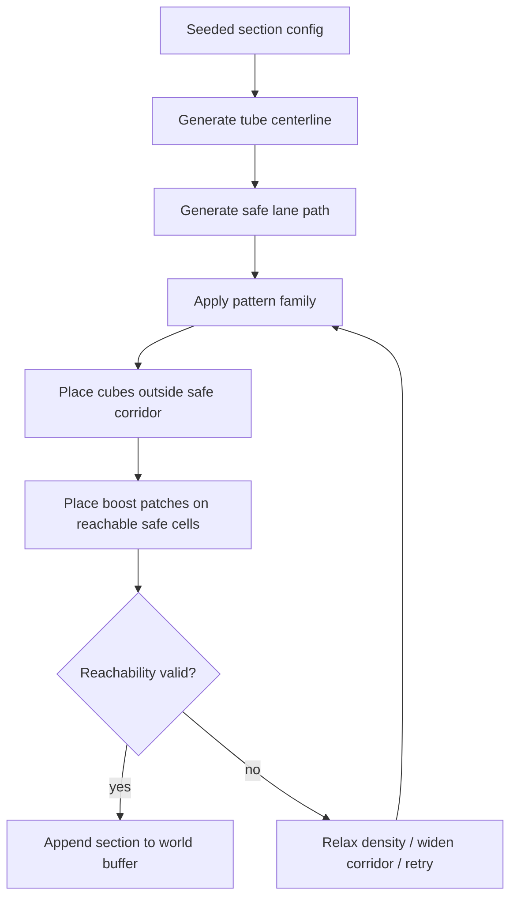
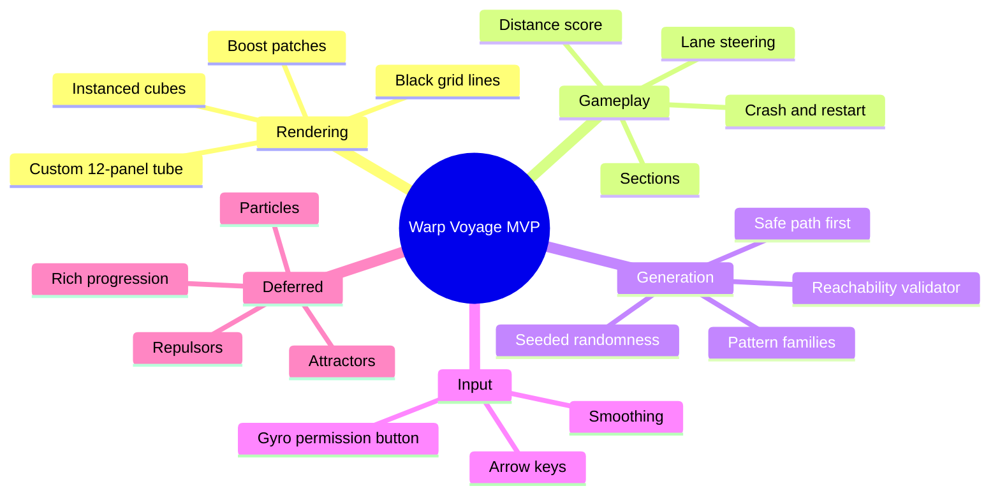
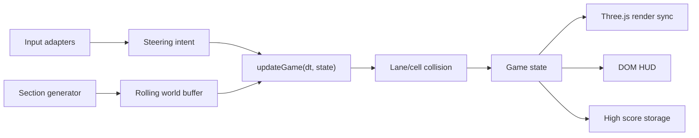
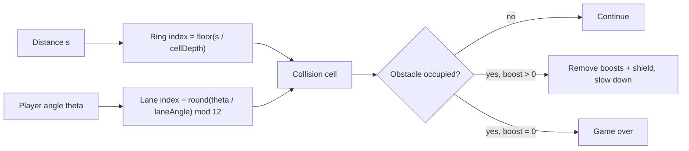
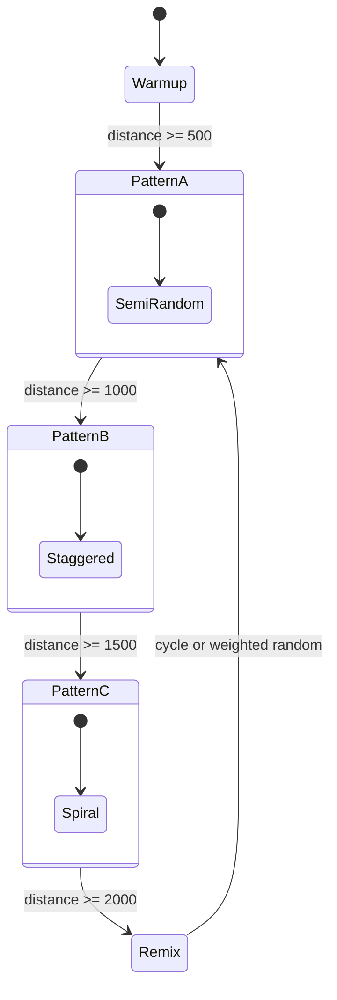
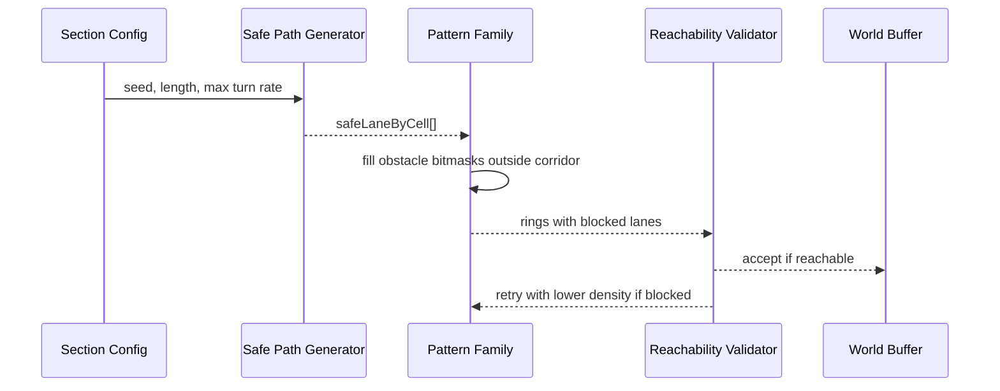
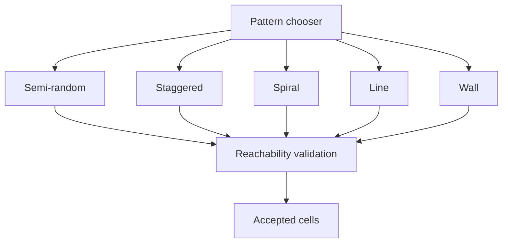
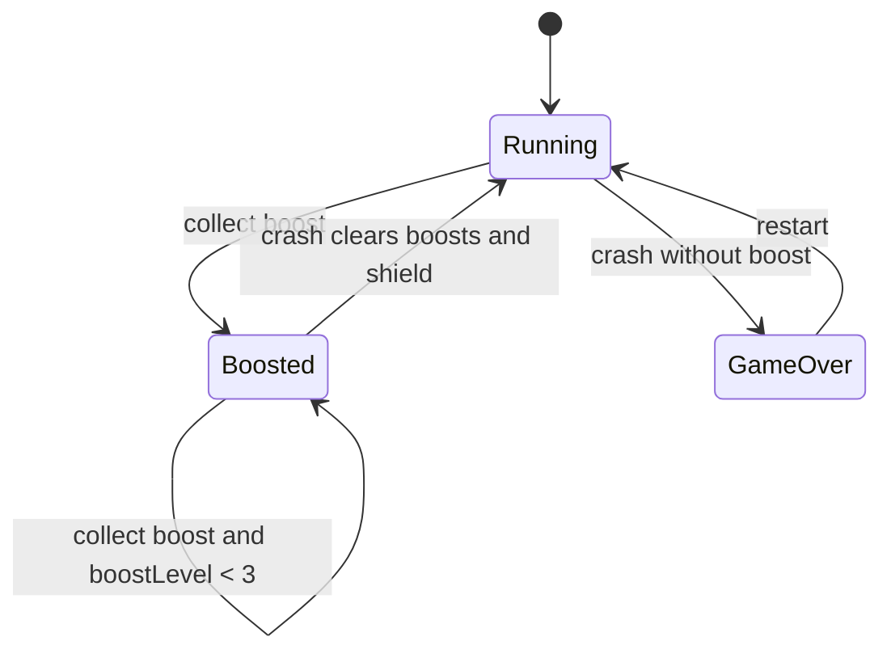

# Warp Voyage Web Game MVP Design Exploration

Status: `[_]`  
Date: 2026-05-15  
Scope: browser MVP for a fast tunnel-dodging game with arrow-key and mobile tilt input.

## Problem Statement

Warp Voyage should feel like a minimal hover-racer inside a 12-panel tube: the player slides around the inside wall, dodges cubes that occupy exact tube grid cells, collects boosts, and survives as long as possible. The MVP has to be fast to build, fast to run, and deliberately small, while leaving a clean future path for particles, attractors, repulsors, richer cube materials, and more procedural variety.

The hardest part is not rendering a tube. The hardest part is generating obstacle patterns that are readable, varied, exciting, and always physically passable under the player's steering limits.

## Executive Summary

Build the MVP as a Vite + TypeScript + Three.js game with one full-screen canvas, no React, no ECS, no physics engine, and no backend. Use a custom procedural tube mesh instead of relying directly on `TubeGeometry`, because Warp Voyage needs exact 12-lane grid ownership and obstacle cells that align perfectly with panel rows.

Generate the game path first, then generate obstacles around it. Each section chooses a pattern family, produces a safe lane corridor across future depth cells, fills cubes outside that corridor, then runs a cheap reachability validator before accepting the slice. This makes "there is always a clean path" a deterministic contract.

The minimal shippable loop is:

- 12 angular lanes around the tube.
- Fixed-depth cells along distance.
- Player has a continuous angular position but collision snaps against lane/cell occupancy.
- Tube bends from a deterministic centerline curve.
- Obstacles are `InstancedMesh` cubes.
- Tube panels and grid lines are simple `BufferGeometry` / `LineSegments`.
- Input is keyboard first, tilt second behind a permission button.
- Score and high score use `localStorage`.
- Boost patches spawn on guaranteed-safe cells and grant boost/shield stacks up to 3.



## Current State In The Repository

Observed filesystem state:

- `/Users/crs/Code/warp-voyage` is a newly initialized Git repository.
- No application source exists yet.
- `.opencode/` contains local assistant/plugin configuration, not game code.
- `docs/explorations/` did not exist before this exploration.

Inference:

- This is effectively a greenfield web game.
- The fastest path is to create the minimal runtime from scratch rather than adapt an existing framework.
- Because there is no existing build system, Vite + TypeScript + Three.js is the lowest-friction setup with good browser dev ergonomics.

## External Research

Relevant current browser and rendering facts:

- Three.js `WebGLRenderer.setAnimationLoop()` is recommended by Three.js for animation-loop compatibility, and renderer options include `powerPreference` and pixel ratio control. This matters for mobile performance and future XR/WebGPU flexibility. Source: [Three.js WebGLRenderer docs](https://threejs.org/docs/pages/WebGLRenderer.html).
- Three.js `BufferGeometry` stores mesh data in GPU-friendly buffers. This is a good match for procedural tube panels and grid lines. Source: [Three.js BufferGeometry docs](https://threejs.org/docs/pages/BufferGeometry.html).
- Three.js `InstancedMesh` reduces draw calls when rendering many objects with shared geometry/material, making it appropriate for repeated cube obstacles. Source: [Three.js InstancedMesh docs](https://threejs.org/docs/pages/InstancedMesh.html).
- Three.js `TubeGeometry` can extrude a tube along a curve, but its output is less direct for exact grid-cell ownership than a custom tube lattice. Source: [Three.js TubeGeometry docs](https://threejs.org/docs/pages/TubeGeometry.html).
- `requestAnimationFrame` timing should use the callback timestamp or equivalent delta time, because high-refresh screens otherwise run animation too quickly. Source: [MDN requestAnimationFrame](https://developer.mozilla.org/en-US/docs/Web/API/Window/requestAnimationFrame).
- Device orientation permission is limited, secure-context-only in supporting browsers, and must be requested from a user gesture. This means gyro control needs an explicit in-game enable button. Source: [MDN DeviceOrientationEvent.requestPermission](https://developer.mozilla.org/en-US/docs/Web/API/DeviceOrientationEvent/requestPermission_static).
- `localStorage` persists per origin across sessions and is sufficient for a high score, but direct `file:` usage has undefined behavior. Serve locally during development. Source: [MDN localStorage](https://developer.mozilla.org/en-US/docs/Web/API/Window/localStorage).

## 🎮 Core MVP Recommendation

### Game Feel Target

The MVP should be about anticipation, not twitch randomness. The player sees a bending white tube with black grid lines, reads cube patterns several cells ahead, then rotates into the lane that gives the best upcoming view and safest path.

Use these baseline constants as a starting point:

| System | MVP Value | Reason |
|---|---:|---|
| Tube sides | 12 | Matches design and gives readable lanes. |
| Tube radius | 6 units | Gives room for camera/player offset. |
| Cell depth | 4 units | Easy collision and visual rhythm. |
| Visible cells | 24-36 | Enough anticipation without overdraw. |
| Player angular speed | 2.5-3.5 lanes/sec | Allows lane changes but preserves pattern pressure. |
| Safe corridor width | 1-2 lanes | Start with 2 lanes, tighten later. |
| Section length | 500 units | Matches proposed score rhythm. |
| Boost interval | 200-350 units | Frequent enough to teach risk/reward. |
| Boost cap | 3 | Matches design. |

### MVP Feature Boundary

Include now:

- Procedural 12-panel tube.
- Curved centerline with gentle bends.
- White tube panels and black grid lines.
- Cube obstacles aligned to lane/depth cells.
- Pattern families: semi-random, staggered, spiral, line, wall.
- Section-based pattern changes every 500 or 1000 distance units.
- Keyboard left/right.
- Optional mobile gyro after user permission.
- Boost patches that double speed, grant shield, and stack to 3.
- Crash rules, game-over state, restart button.
- Distance score and local high score.

Defer:

- Particles.
- Attractors/repulsors.
- Complex ship model.
- Audio-reactive visuals.
- Deep material systems.
- Multiplayer/leaderboards.
- Physics engine.
- Procedural mesh booleans or collision meshes beyond lane/cell occupancy.



## Architecture Shape

Use small functional modules with one mutable `GameState` object passed through pure-ish update functions. That respects functional/declarative preference while avoiding per-frame allocations that hurt browser games.

Recommended initial file layout:

```text
src/
  main.ts
  game/
    config.ts
    state.ts
    loop.ts
    scoring.ts
    collision.ts
  input/
    keyboard.ts
    gyro.ts
  generation/
    rng.ts
    sections.ts
    safePath.ts
    patterns.ts
    validate.ts
  render/
    scene.ts
    tubeMesh.ts
    obstacles.ts
    camera.ts
    hud.ts
```

Runtime module flow:



### Why Not React For The MVP?

React is not needed for this game loop. The HUD is tiny: score, boost/shield indicators, gyro enable button, restart button. A few DOM nodes updated from the game loop are simpler and faster. React can be introduced later for menus/settings if needed.

### Why Not A Physics Engine?

The world is a cylindrical grid. Cubes occupy exact cells. The player's collision footprint can be expressed as `(lane, depthCell)` plus a small angular tolerance. A physics engine would add cost and ambiguity without improving the MVP.

## Spatial Model

Represent the tube as rings along distance. Each ring has 12 lanes. A cube is a cell: `(sectionId, depthIndex, laneIndex)`.



### Tube Coordinates

Keep gameplay in lane/depth coordinates and render them into 3D only at the boundary:

- `s`: distance along centerline.
- `lane`: integer `0..11`.
- `u`: angular lane center.
- `r`: tube radius.
- `center(s)`: point on curved tube centerline.
- `frame(s)`: tangent/normal/binormal basis.
- `worldPoint(s, lane, offset)`: centerline plus radial offset inside the tube.

For the MVP, camera and player can travel at the same `s`, with the camera trailing slightly behind and inward from the player's tube-wall position.

## Tube Rendering Strategy

Recommended: custom mesh and line geometry.

Generate a rolling window of rings. Each ring has 12 vertices around the inside of the tube. Adjacent rings form 12 quad panels. Use a basic white material with `side: BackSide` or explicitly face the normals inward. Overlay black grid lines using line segments for radial and longitudinal edges.

Why custom instead of direct `TubeGeometry`:

- exact 12 panel ownership;
- direct mapping from lane/depth cells to vertices;
- easier grid line control;
- easier cube placement at panel centers;
- easier future deformation by replacing centerline/frame functions.

`TubeGeometry` remains useful as a reference or later fallback for smooth decorative layers, but the gameplay tube should be a grid lattice.

## Procedural Sections

The world should be generated in sections. Each section owns:

- distance start/end;
- section pattern family;
- obstacle density;
- safe path aggressiveness;
- bend profile;
- boost schedule;
- color/material palette seed.



Recommended first progression:

1. `0-500`: warmup semi-random, low density, wide safe corridor.
2. `500-1000`: staggered gates, medium density.
3. `1000-1500`: spiral/line mix, medium density, gentle bends.
4. `1500-2000`: wall patterns with clear 2-lane gaps.
5. `2000+`: weighted random sections with density and speed pressure.

## 🧭 Obstacle Generation: Path First

Do not generate cubes randomly and then search for a path. Generate the safe path first.

### Safe Path Model

For each future depth cell, pick a preferred safe lane. The safe lane can only move at a limited rate:

- `maxLaneStep = 0` for straight relief.
- `maxLaneStep = 1` for normal play.
- Avoid `maxLaneStep = 2` until high speeds or late-game patterns.

Then create a safe corridor:

- beginner: safe lane plus adjacent lane on both sides;
- normal: safe lane plus one adjacent lane;
- high pressure: only safe lane, but only for short bursts.



### Reachability Validator

Even if a safe path exists by construction, validate the actual obstacle field against the player's steering limits. This catches pattern mistakes and future tuning regressions.

Validator state:

- `reachableLanes`: set of lanes the player could occupy at current ring.
- `allowedLanes`: lanes without obstacle collision at next ring.
- `maxStepPerCell`: derived from player turn speed, speed multiplier, and cell depth.

For each ring:

1. Expand reachable lanes by `maxStepPerCell`.
2. Intersect with allowed lanes.
3. If empty, reject or relax the generated chunk.

This is cheap: `12 lanes * visible rings` per generation pass.

## Pattern Families

All pattern functions should share the same signature:

```ts
type PatternFn = (input: {
  rng: Rng;
  cellIndex: number;
  safeLane: number;
  safeWidth: number;
  density: number;
  lanes: 12;
}) => number; // 12-bit blocked-lane mask
```

Each pattern returns a 12-bit mask, where bit `1 << lane` means a cube is present in that lane at this depth cell.

### Semi-Random

Goal: readable noise and early variety.

Rules:

- Block `0-4` lanes based on density.
- Never block safe corridor.
- Prefer non-adjacent blockers at low difficulty.
- Occasionally repeat a previous mask for 2 cells to create visual chunks.

Best use: warmup and transitions between more authored patterns.

### Staggered

Goal: rhythmic lane weaving.

Rules:

- Every 2-3 cells, place blockers alternating left/right of safe path.
- Keep a 1-cell blank beat before sharp safe-path changes.
- Use mirrored blockers to make the pattern readable.

Best use: teaching that the tube is track-based.

### Spiral

Goal: a helix of danger that asks the player to rotate smoothly.

Rules:

- Place 1-3 blockers at `baseLane + cellIndex * direction`.
- Safe path either follows beside the spiral or cuts through intentional gaps.
- Avoid placing the spiral directly over the safe lane for more than one upcoming cell.

Best use: mid-game, especially with gentle tube bends.

### Line

Goal: a continuous rail of cubes that defines a boundary.

Rules:

- Pick one or two lanes and block them for `6-12` cells.
- Use line lanes away from the safe corridor.
- Occasionally rotate the line lane by one step at section boundaries.

Best use: visual identity and low-cost performance.

### Wall

Goal: exciting gates.

Rules:

- A wall is one ring with many blocked lanes.
- Leave a 2-3 lane contiguous gap centered on the safe lane.
- Never place walls on consecutive cells without blank recovery space.
- At high speed, wall gaps must appear earlier in the visible horizon.

Best use: section punctuation and score milestones.



## ⚡ Boost Design

Boost patches should create a meaningful risk/reward loop without adding a new movement system.

Recommended MVP behavior:

- Boost patch occupies a floor panel cell, not the whole ring.
- It spawns only in a reachable safe lane.
- Collecting it increments `boostLevel` up to 3 and sets/refreshes `shield = true`.
- Speed multiplier should be tuned conservatively even if the design language says "doubles."

Two possible boost multipliers:

| Model | Multipliers | Pros | Cons |
|---|---|---|---|
| Literal doubling | `1x, 2x, 4x, 8x` | Matches the fantasy. Very exciting. | 8x may break readability unless cell spacing and view distance scale heavily. |
| MVP tuned doubling feel | `1x, 2x, 3x, 4x` | Easier to tune and keep readable. | Less literal. |

Recommendation: start with `1x, 2x, 3x, 4x` and name it "boost stacks" rather than promising mathematical doubling in UI. If the game still feels readable, test `1x, 2x, 4x, 6x` before trying `8x`.

Crash rule:

- If `boostLevel > 0`, a crash clears all boosts and shield, plays a strong feedback event, and continues at base speed.
- If `boostLevel === 0`, a crash ends the run.



## Controls

### Keyboard

Use simple intent:

- left arrow: `steer = -1`;
- right arrow: `steer = +1`;
- neither or both: `steer = 0`;
- optional `A/D` support costs almost nothing.

Steering updates continuous angular position:

```text
angle += steer * angularSpeed * dt
laneFloat = angle / laneAngle
```

Collision can round `laneFloat`, while rendering uses the continuous value for smooth motion.

### Gyro

Gyro should be optional and progressive:

- Show a small "tilt" icon/button on mobile-capable devices.
- On click/tap, call `DeviceOrientationEvent.requestPermission()` when available.
- If granted, use `gamma` as steering intent after calibration.
- If denied or unavailable, keep keyboard/touch fallback.

Use a low-pass filter:

```text
tiltFiltered = lerp(tiltFiltered, rawGamma - neutralGamma, 0.12)
steer = clamp(tiltFiltered / 18deg, -1, 1)
```

MVP fallback for mobile without gyro: add invisible left/right touch zones only if testing shows gyro permission friction is too high.

## Camera And Readability

The player is conceptually riding along the bottom-inside surface of the tube, but the game can render from a near-third-person/FPV hybrid:

- Camera trails slightly behind the player.
- Camera sits closer to tube center than the player, so obstacles remain visible.
- Camera rolls with player orientation but dampens hard changes.
- Tube bend ahead should influence the camera look-at point.

Readability rules:

- Keep grid lines crisp and black.
- Keep tube white/off-white.
- Use cube colors with high contrast and procedural surface patterns, but do not let patterns reduce silhouette clarity.
- Avoid heavy bloom in the MVP.
- Increase visible distance as speed/boost increases.
- Do not place dense wall patterns immediately after blind bends.

## Collision Model

MVP collision can be grid-based:

- Compute player depth cell from distance.
- Compute current lane from angular position.
- Check current cell and maybe one lookahead cell based on player radius.
- If occupied, trigger crash.
- Use a short invulnerability window after shield crash to prevent immediate repeat collision.

This is intentionally forgiving. Pixel-perfect collision will make the game feel unfair because the camera bends and player orientation are already cognitively demanding.

## Data Model Sketch

```ts
type Lane = number; // 0..11
type CellIndex = number;

type Section = {
  readonly id: number;
  readonly startDistance: number;
  readonly endDistance: number;
  readonly pattern: "semiRandom" | "staggered" | "spiral" | "line" | "wall";
  readonly seed: number;
  readonly obstacleMasks: readonly number[]; // one 12-bit mask per cell
  readonly boostCells: readonly { cell: CellIndex; lane: Lane }[];
};

type PlayerState = {
  readonly distance: number;
  readonly angle: number;
  readonly speed: number;
  readonly boostLevel: 0 | 1 | 2 | 3;
  readonly shielded: boolean;
};
```

Use immutable section data. Keep player state mutable inside the hot loop if profiling says allocation matters, but expose update functions as pure transforms where practical.

## Example Code: Pattern-Safe Generation

This is a compact version of the recommended generator contract. It intentionally separates safe-path creation from obstacle masks and validation.

```ts
const LANES = 12;
const laneMask = (lane: number) => 1 << ((lane + LANES) % LANES);

const corridorMask = (center: number, width: number): number =>
  Array.from({ length: width * 2 + 1 }, (_, i) => center + i - width)
    .reduce((mask, lane) => mask | laneMask(lane), 0);

const randomMaskOutside = (
  rng: () => number,
  safeMask: number,
  density: number,
): number =>
  Array.from({ length: LANES }, (_, lane) => lane)
    .filter((lane) => (safeMask & laneMask(lane)) === 0)
    .reduce(
      (mask, lane) => (rng() < density ? mask | laneMask(lane) : mask),
      0,
    );

const reachableAfter = (
  previous: ReadonlySet<number>,
  blockedMask: number,
  maxStep: number,
): ReadonlySet<number> => {
  const expanded = [...previous].flatMap((lane) =>
    Array.from({ length: maxStep * 2 + 1 }, (_, i) => lane + i - maxStep),
  );

  return new Set(
    expanded
      .map((lane) => (lane + LANES) % LANES)
      .filter((lane) => (blockedMask & laneMask(lane)) === 0),
  );
};

const validateMasks = (
  masks: readonly number[],
  startLane: number,
  maxStepPerCell: number,
): boolean => {
  const initial = new Set([startLane]);

  const finalReachable = masks.reduce<ReadonlySet<number>>(
    (reachable, mask) =>
      reachable.size === 0
        ? reachable
        : reachableAfter(reachable, mask, maxStepPerCell),
    initial,
  );

  return finalReachable.size > 0;
};
```

## Options And Tradeoffs

### Option A: Pure Canvas 2D Fake 3D

Pros:

- Fastest possible prototype.
- No 3D mesh math.
- Very easy deployment.

Cons:

- Hard to sell the bending tube fantasy.
- Gyro/camera feel less convincing.
- Later particles/attractors may require a rewrite.

Verdict: good for a one-day mechanic spike, not ideal as the main MVP.

### Option B: Three.js Custom Tube Lattice

Pros:

- Accurate 12-lane tube grid.
- Direct cube placement.
- Good performance with instancing.
- Future-friendly for particles and forces.
- Still small enough for a fast MVP.

Cons:

- Requires frame math for curved centerline.
- Needs careful grid-line rendering.

Verdict: recommended.

### Option C: Three.js TubeGeometry-First

Pros:

- Very quick curved tube mesh.
- Official geometry supports path extrusion.

Cons:

- Gameplay grid mapping is less explicit.
- Grid lines and cube centers are harder to keep exact.
- More likely to accumulate hacks around panel ownership.

Verdict: acceptable for a visual prototype, but not the gameplay foundation.

### Option D: Full ECS / Physics Architecture

Pros:

- Scales to complex future systems.
- Clear entity modeling.

Cons:

- Slower to build.
- More abstractions than the MVP needs.
- Can obscure the core obstacle-generation problem.

Verdict: defer until real complexity appears.

## Performance Notes

Performance budget should assume mobile browsers:

- Keep cube draw calls low with `InstancedMesh`.
- Reuse geometries, materials, matrices, vectors, and typed arrays.
- Generate only a rolling window ahead of the player.
- Remove old sections behind the player.
- Cap pixel ratio, for example `Math.min(devicePixelRatio, 2)`.
- Avoid shadows, postprocessing, transparent overdraw, and dynamic texture creation in the MVP.
- Use simple `MeshBasicMaterial` or `MeshLambertMaterial` initially.

The game should have no per-frame React state updates because React is not needed for the canvas loop.

## ⚠️ Risks And Mitigations

| Risk | Why It Matters | Mitigation |
|---|---|---|
| Generated obstacles are technically passable but feel unfair | Player perception matters more than validator success | Keep safe corridor wider, add blank beats after sharp turns, test at each boost speed. |
| Tube bends hide hazards too aggressively | The design wants anticipation, not blind punishment | Limit bend curvature before wall/spiral sections; scale view distance with speed. |
| Gyro permission is unreliable or awkward | Mobile control is a headline feature | Keep keyboard/touch fallback and request permission only on user tap. |
| Literal 8x boost is unreadable | Boost stack can outrun reaction time | Start with tuned multipliers and increase only after playtesting. |
| Procedural cube colors become visual noise | Obstacles must remain legible | Keep silhouettes solid, use procedural patterns as secondary face detail. |
| Custom tube mesh math takes too long | MVP needs speed | Start with straight tube, then add centerline bends after movement/collision work. |

## Implementation Checklist

- [x] Create Vite + TypeScript project with Three.js.
- [x] Add a full-screen canvas and minimal DOM HUD.
- [x] Implement deterministic RNG.
- [x] Implement 12-lane/depth-cell coordinate helpers.
- [x] Render a straight 12-panel white tube with black grid lines.
- [x] Add rolling tube segment recycling.
- [x] Add player angular steering with arrow keys and `A/D`.
- [x] Add camera follow/roll behavior.
- [x] Implement section data and distance score.
- [x] Implement safe-path generator.
- [x] Implement semi-random pattern.
- [x] Implement reachability validator.
- [x] Render cube obstacles via `InstancedMesh`.
- [x] Add grid-based collision.
- [x] Add game-over state and restart button.
- [x] Save high score to `localStorage`.
- [x] Add staggered, spiral, line, and wall patterns.
- [x] Add boost patches on reachable safe cells.
- [x] Implement boost/shield crash rules.
- [x] Add section changes every 500 or 1000 units.
- [x] Add gentle tube bends.
- [x] Add gyro permission flow and tilt steering.
- [x] Tune safe corridor, density, speed, and boost multipliers.

## Validation Checklist

- [ ] New game starts within one click/key press on desktop.
- [ ] Arrow keys move the player smoothly around the tube.
- [ ] Every generated section passes reachability validation.
- [ ] The player can survive warmup sections without knowing the game.
- [ ] Wall patterns always show a readable gap before impact.
- [ ] Spiral patterns feel smooth rather than random.
- [ ] Boost patches are reachable and visually distinct.
- [ ] Crash with boost clears boost and continues the run.
- [ ] Crash without boost ends the run.
- [ ] Restart fully resets player/world state but preserves high score.
- [ ] High score persists after page reload through local dev server.
- [ ] Gyro permission is requested only after a user gesture.
- [ ] Gyro denial leaves the game playable.
- [ ] Mobile frame rate remains stable with visible cubes.
- [ ] No section can spawn cubes inside the safe corridor.
- [ ] Increased speed also increases view distance or reduces pattern density.

## Suggested Build Order

```mermaid
gantt
  title MVP Build Sequence
  dateFormat  X
  axisFormat %s
  section Foundation
  Vite/Three setup           :0, 1
  Straight tube/grid render  :1, 2
  Keyboard steering/camera   :2, 2
  section Gameplay
  Score/restart/storage      :4, 1
  Safe path generator        :5, 2
  Cube rendering/collision   :7, 2
  section Variety
  Pattern families           :9, 3
  Boost/shield loop          :12, 2
  Tube bending               :14, 2
  section Mobile
  Gyro permission/control    :16, 2
  Mobile tuning              :18, 2
```



## ✅ Recommended Next Actions

1. Scaffold the project with Vite, TypeScript, and Three.js.
2. Build a straight tube with 12 panel lanes and black grid lines.
3. Implement keyboard steering and camera motion before obstacles.
4. Implement the safe-path generator and validator before adding visual pattern complexity.
5. Add only semi-random and wall patterns first; they reveal most fairness problems.
6. Add boosts after collision feels reliable.
7. Add tube bends last, because bends change readability and pattern tuning.

## References

- [Three.js WebGLRenderer](https://threejs.org/docs/pages/WebGLRenderer.html)
- [Three.js BufferGeometry](https://threejs.org/docs/pages/BufferGeometry.html)
- [Three.js InstancedMesh](https://threejs.org/docs/pages/InstancedMesh.html)
- [Three.js TubeGeometry](https://threejs.org/docs/pages/TubeGeometry.html)
- [MDN requestAnimationFrame](https://developer.mozilla.org/en-US/docs/Web/API/Window/requestAnimationFrame)
- [MDN DeviceOrientationEvent.requestPermission](https://developer.mozilla.org/en-US/docs/Web/API/DeviceOrientationEvent/requestPermission_static)
- [MDN localStorage](https://developer.mozilla.org/en-US/docs/Web/API/Window/localStorage)
