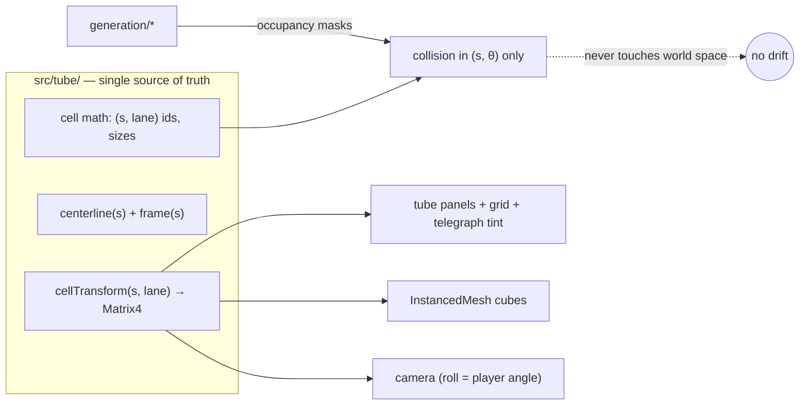
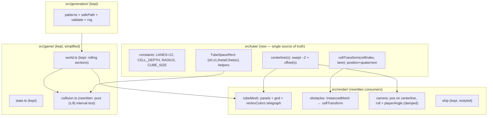
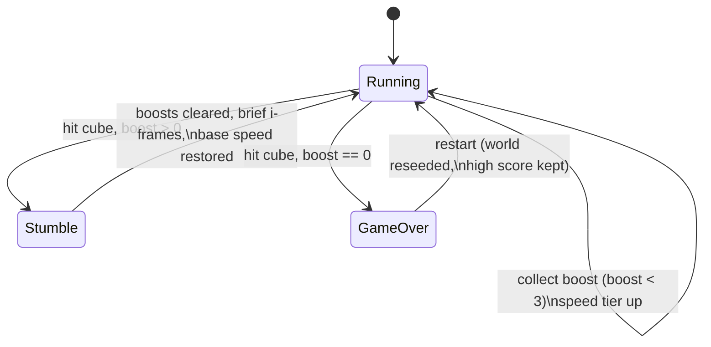

# MVP Rebuild Around A Tube-Space Core

Status: `[_]`
Date: 2026-06-10
Scope: rethink the buggy MVP from first principles; decide rewrite-vs-refactor; define the spatial model, telegraphing, camera, and collision contract that make the game feel correct and fun.

## Problem Statement

Warp Voyage exists and runs, but it does not feel right. The last four commits (`f8cca79`, `81d8b75`, `bd6b890`, `dd2bbfc`) are all attempts to make collision agree with what is rendered, and each fix has been a manual re-alignment of two independent codepaths. The game is buggy enough that the honest question is: patch, rebuild the core, or start from scratch?

The target experience, restated from the design brief:

- The player rides the **bottom inside surface** of a tube and stays visually fixed there; left/right input **rotates the tube around the player** rather than moving a ship around a static tube.
- The tube has **12 angular sections (lanes)**; each section is a grid of squares along depth; **one cube fills exactly one square**.
- Cubes **telegraph** their arrival by tinting the tube panel they sit on, well before they are visible as geometry — the signature mechanic of the original game.
- Visuals start **deliberately minimal**: white tube, black grid lines, black cubes. Rainbow cubes come later.
- Arrow keys steer; **boost pickups** appear occasionally; hitting a cube with boost strips the boost, hitting without boost is game over.
- The tube **undulates dramatically**, and there is **always a survivable path** through every pattern.

## Executive Summary

Do not start from scratch, and do not keep patching. Roughly half the codebase — generation (`safePath`, `patterns`, `validate`, `rng`), input, scoring, and the lane/angle math — is clean, tested, and exactly what the design needs. The other half — the spatial relationship between rendering and collision — has a structural flaw: **cube placement is defined by the renderer and re-derived by collision**, so every render tweak silently breaks collision. That is why the same bug has been "fixed" four times.

The rebuild centers on three decisions:

1. **One tube-space module.** Create `src/tube/` as the single owner of the mapping `(s, lane) → world transform` and of all cell geometry constants. Rendering consumes it to place vertices and cubes; collision never touches world space at all — it works purely in `(s, θ)` cell coordinates. After this, render/collision disagreement becomes impossible by construction, not by diligence.
2. **Player-fixed camera (tube rotates).** Replace the orbit-the-tube camera with a camera whose roll is locked to the player's angle, so the player always sits at the bottom of the screen and steering visibly spins the tube. This single change delivers the core feel of the original game.
3. **Telegraph via panel vertex colors.** The tube mesh gains per-panel color; any cell that contains a cube within the telegraph horizon (~10 cells) tints that panel before the cube geometry is prominent. This is the original Boost 2 warning mechanic, confirmed by period reviews.

External research identified the original game as **Boost 3D / Boost 2** by Jonathan Lanis (iOS, 2009, renamed 2011, dead since ~2017), and its confirmed mechanics map almost one-to-one onto this brief — including the tube-wall color warnings, boost arrows, smash-through-with-boost, and the clean white-tube aesthetic.



## Current State In The Repository

The repo is a Vite + TypeScript + Three.js app, ~1,769 LOC in `src/`, with vitest unit tests (281 LOC) and a thin Playwright e2e suite. Summary of the audit:

### Salvageable as-is (keep, mostly untouched)

| Area | Files | Why keep |
|---|---|---|
| Lane/angle math | `src/game/coordinates.ts` | Pure, well-tested conversions (`normalizeLane`, `laneDistance`, `angularDistance`). |
| Generation | `src/generation/safePath.ts`, `patterns.ts`, `validate.ts`, `rng.ts`, `sections.ts` | Safe-path-first generation with a reachability validator is exactly the "always a path" contract; 5 pattern families already exist. |
| Input | `src/input/keyboard.ts`, `gyro.ts`, `controller.ts` | Clean adapters; keyboard-first matches the MVP brief. |
| Scoring | `src/game/scoring.ts` | Trivial and tested. |
| Player physics | `src/game/state.ts` | `distance += speed·dt; angle += steer·rate·dt` — correct and minimal. |

### Structurally flawed (rebuild)

| Area | Files | Problem |
|---|---|---|
| Cube placement | `src/render/obstacles.ts` (170 LOC) | `lanePanelPoint()` + `orientToPanel()` define cube transforms inside the renderer; collision must mirror them by hand. |
| Collision | `src/game/collision.ts` (123 LOC) | Hardcoded empirical constants (`SHIP_COLLISION_CENTER_Z = -0.25`, `SHIP_COLLISION_HALF_DEPTH = 0.95`) tuned to match render output rather than derived from a shared spec. |
| Tube mesh | `src/render/tubeMesh.ts` (109 LOC) | Rebuilds panel/grid vertex buffers procedurally each frame with no per-panel color attribute — no place to hang telegraphing. |
| Camera | `src/render/camera.ts` (24 LOC) | Orbits the camera around a mostly-static tube; the brief wants the inverse (player fixed at bottom, tube rotates). |
| Centerline | `src/render/tubeMath.ts` | Gentle sinusoidal weave (±3.2 X, ±2.2 Y) — far short of "undulates dramatically", and it lives in `render/`, which is the wrong owner for gameplay-relevant geometry. |
| Game loop | `src/main.ts` (236 LOC) | Glue is acceptable but mixes collision frame-gathering with rendering concerns. |

### The recurring bug, diagnosed

Git history tells the story plainly:

```
dd2bbfc fix(collision): align checks with rendered cubes
bd6b890 fix(collision): require visual cube overlap
81d8b75 fix(render): rotate cubes to panel centers
f8cca79 fix(render): align cubes to tube panels
```

Each commit moved one side (render or collision) to agree with the other. The audit's conclusion: this is **not** a series of unrelated small bugs — it is one architectural defect, *two sources of truth for cube placement*, producing an endless sequence of small bugs. No patch ends the sequence; only unifying the spatial model does.

### Missing entirely

- **Telegraphing.** No tube-wall color warning exists in any form — the signature mechanic of the original game is absent.
- **The "tube rotates around you" feel.** The camera follows the player around the tube instead of holding the player at screen-bottom.
- **The minimal black/white look.** Cubes are currently rainbow-per-cube (`cubeColor()` HSL hashing in `obstacles.ts`), which conflicts with the simplify-first directive and undercuts telegraph colors later.

## External Research

### The original game: Boost 3D / Boost 2 (Jonathan Lanis, iOS)

The game remembered as "Zoom / Zoom 2" is, with high confidence, **Boost 3D** (Oct 2009), renamed **Boost 2** in June 2011 — App Store id 333191476, last updated 2015, unrunnable on 64-bit-only iOS since ~2017. TouchArcade: *"Among the iPhone tunnel games, Boost is king."* It was featured in Apple's best-of-2009 and an iPod Touch TV commercial.

Confirmed mechanics, with direct relevance to this MVP:

| Boost 2 mechanic | Source quote | What it means for Warp Voyage |
|---|---|---|
| Tube-wall color telegraphs | *"The tunnel's early stages color the lanes on which obstacles are about to appear; the game phases these cues out eventually"* (iFanzine) | Telegraphing is panel tinting on the tube wall itself, not a HUD element. It can also become a difficulty dial — fade the cues as skill rises. |
| Boost = smash-through | Boost arrows on the floor; while boosted the player *smashes through* blocks, consuming the boost | Crash-with-boost strips boost and continues; crash without boost ends the run. Matches the brief exactly. |
| Auto-accelerating speed | Speed ramps continuously; survival is the only goal | Distance score; no points-for-style systems needed. |
| Morphing tunnel | *"the stage rumbles, opens, closes, twists and turns"* (iFanzine) | The dramatic undulation isn't decoration; it is the game's long-run difficulty texture. |
| Visual style | *"sterile white tube"*, bold colored blocks, *"super clean and polished"* | The white-tube/black-cube MVP is faithful, not a placeholder. Colored cubes + colored telegraphs are the authentic upgrade path. |
| Movement | **Tilt-based lateral shift** — Boost 2 did *not* allow full 360° rotation around the tube | Warp Voyage's full-rotation steering is a deliberate departure (closer to SpeedX 3D), and a good one for keyboard play — but it means patterns must be tuned for wraparound reachability, which the existing validator already handles. |

Key links: [TouchArcade review (2009)](https://toucharcade.com/2009/10/15/boost-3d-delivers-solid-tunnel-madness/), [Boost 2 rename coverage](https://toucharcade.com/2011/06/02/boost-3d-update/), [AppSpy review](https://www.appspy.com/review/3855/boost-2), [iFanzine review](https://ifanzine.com/boost-2-review/), [gameplay video](https://www.youtube.com/watch?v=XOCAZ-eL8mU), [OUYA port on archive.org](https://archive.org/details/ouya_com.jonathanlanis.boostOUYA_2.0.4).

### Implementation prior art

- **Collision must live in tube space.** The standard failure mode for curved-tube runners is world-space box intersection: a player at θ=90° occupies totally different world axes than at θ=0°, so `Box3` tests behave inconsistently around bends. The robust pattern is `(s, θ)` interval overlap — obstacle occupies `[s₀,s₁] × [θ₀,θ₁]`, player occupies a point/small rect, test is 2D with angular wraparound. This is precisely the model that ends the repo's render/collision drift.
- **Frenet frames twist; parallel transport doesn't.** Three.js `computeFrenetFrames` flips violently near straight segments and inflection points. For a true 3D curve, parallel-transport frames are required ([janakiev.com](https://janakiev.com/blog/framing-parametric-curves/), [giordi91](https://giordi91.github.io/post/2018-31-07-parallel-transport/)). However — see Key Findings — the repo's existing "swept along −Z with lateral offsets" model sidesteps frames entirely and is the better choice for this game.
- **Infinite tube = rolling window + InstancedMesh.** Recycle a window of cells ahead of the player; all cubes in one `InstancedMesh` (one draw call); hide recycled instances by zero-scaling their matrix. The repo already does both correctly. The Codrops UV-scroll trick ([Infinite Tubes](https://tympanus.net/codrops/2017/05/09/infinite-tubes-with-three-js/)) is aesthetic-only and unsuitable for real obstacles.
- **Arc length matters for real curves** (`getPointAt` vs `getPoint`), but is moot under the swept-offset model where `s` maps linearly to Z.

## Key Findings

1. **The bug factory is architectural, and the fix is small.** Both render and collision already *call the same functions* — they're just allowed to diverge because the functions live in `render/` and collision re-encodes their output as constants. Moving ~100 LOC into a `src/tube/` module with a typed contract ends the class of bug. A rewrite from scratch would rebuild 1,300 LOC of working code to fix 100 LOC of misplaced code.

2. **The swept-offset centerline is a feature, not a hack.** `centerlinePoint()` in `tubeMath.ts` advances linearly in −Z and offsets X/Y by smooth functions of `s`. This means: no Frenet twist, `s` is exactly arc length in Z, `(s, θ)` math stays exact under arbitrary undulation amplitude, and "dramatic turns" are just bigger/faster offset functions plus camera look-ahead. A true Catmull-Rom centerline would buy visual loop-the-loops at the cost of parallel-transport frames, arc-length tables, and a far hairier collision story. Wrong trade for an MVP.

3. **Telegraphing is panel paint, nearly free.** The tube mesh already rebuilds its vertex buffer every frame from cell data. Adding a per-vertex `color` attribute and a `vertexColors: true` material lets any panel tint from the same occupancy masks collision uses — same source of truth, zero extra draw calls, and the telegraph can fade in with distance (subtle at 10 cells out, saturated at 3).

4. **"Tube rotates around player" is a camera statement, not a physics one.** Internally the player's angle still changes; the *camera* rolls so the player's angle is always rendered at screen-bottom. One small camera module change produces the entire perceived mechanic. Damped roll (~10–12 Hz exponential smoothing) keeps fast steering from feeling like a paint shaker.

5. **The fun gap is feel, not systems.** Generation, boost rules, scoring, and restart all exist. What's missing is: correct collision (architectural fix), the rotation feel (camera fix), telegraphing (mesh fix), and visual clarity (palette fix). All four are concentrated in the render/spatial layer — which is exactly the layer being rebuilt.

## Options And Tradeoffs

### Option A: Keep patching the existing code

Continue the `fix(collision)` series; add telegraph and camera changes onto the current structure.

- ✅ No structural work; each change is small.
- ❌ The two-sources-of-truth defect remains; every future render change risks silent collision drift (it has already happened four times).
- ❌ Telegraphing still needs the tube mesh rewritten for vertex colors, so the biggest single task is shared with Option B anyway.

Verdict: pays the rebuild cost in installments, forever.

### Option B: Rebuild the spatial core in place, keep the rest (recommended)

Create `src/tube/` as sole owner of cell math + centerline + transforms; rewrite `tubeMesh`, `obstacles`, `camera`, and `collision` against it; keep `generation/`, `input/`, `scoring`, `state`, `coordinates` as-is. Strip visuals to white/black.

- ✅ Eliminates the bug class structurally; ~600 LOC touched, ~1,200 LOC preserved with their tests.
- ✅ Telegraphing and camera-roll fall out naturally from the new mesh and tube modules.
- ✅ Existing unit tests for generation/coordinates keep guarding the preserved half.
- ❌ Requires discipline: during the rebuild, the game is briefly unplayable (mitigate by sequencing: tube module → mesh → camera → cubes → collision, keeping main.ts compiling throughout).

### Option C: Full rewrite from scratch

- ✅ Cleanest possible architecture; no legacy constraints.
- ❌ Rebuilds the already-good half (generation + validator + input + tests) for no benefit; realistic risk of re-introducing solved problems (reachability, deterministic RNG, gyro permission flow).
- ❌ Slowest path to a playable MVP.

### Option D: Switch to TubeGeometry + Catmull-Rom "real" curve

- ✅ Visually richer bends (true 3D curvature, banked turns).
- ❌ Requires parallel-transport frames, arc-length parameterization, and tube-space↔world conversions through a frame table — precisely the machinery that makes collision drift likely again.
- ❌ The prior exploration (0000) already evaluated and rejected TubeGeometry-first for grid-ownership reasons; nothing has changed.

Verdict table:

| | A: Patch | **B: Core rebuild** | C: Scratch | D: Real curve |
|---|---|---|---|---|
| Ends collision-drift bug class | ❌ | ✅ | ✅ | ⚠️ reintroduces risk |
| Time to fun MVP | medium, asymptotic | **fast** | slow | slow |
| Preserves working tests | ✅ | ✅ | ❌ | partial |
| Dramatic undulation | ⚠️ | ✅ (bigger offsets) | ✅ | ✅✅ |
| Risk | chronic | low | medium | high |

## Recommendation

**Option B.** Rebuild the spatial core around a single `src/tube/` module; keep generation, input, scoring, and player state; restyle to white-tube/black-cube; add panel-tint telegraphing and a player-fixed rolling camera.

### Target architecture



### The collision contract (the heart of the fix)

Collision never sees a `Vector3`. A cube at `(cell c, lane l)` occupies, by definition:

- `s ∈ [c·CELL_DEPTH, (c+1)·CELL_DEPTH]`
- `θ ∈ [l·LANE_ANGLE, (l+1)·LANE_ANGLE]`

The player is a point `(s_p, θ_p)` with a small half-extent (`±0.35·CELL_DEPTH` in s, `±0.30·LANE_ANGLE` in θ — forgiving on purpose; tune later). The renderer draws the cube to *exactly fill* that same cell via `cellTransform`. There is nothing to align because both sides read the same definition.

```mermaid
sequenceDiagram
  participant In as input
  participant St as game/state
  participant W as game/world
  participant C as game/collision
  participant T as src/tube
  participant R as render

  In->>St: steer ∈ [-1,1]
  St->>St: s += speed·dt; θ += steer·rate·dt
  St->>W: ensure cells [s, s+horizon] generated
  W->>C: occupancy masks near s
  C->>C: overlap((s_p,θ_p) ± extents, cell rects)?
  C-->>St: none | boost pickup | crash
  St->>R: render snapshot {s, θ, masks, telegraphHorizon}
  R->>T: cellTransform / centerline for visible window
  R->>R: tint panels where mask bit set within horizon
```

### Crash and boost rules



### Telegraph design

- Horizon: panels tint when their cell is within **10 cells (~40 units)** of the player; alpha ramps 0 → 1 between 10 and 3 cells out, so warnings *grow* rather than pop.
- MVP palette: tube white `#f5f5f2`, grid lines near-black, cubes black, telegraph tint mid-gray → black gradient (pure monochrome). When rainbow cubes arrive later, the telegraph inherits each cube's color automatically — the tint is sourced from the cube's color field, which is `black` for now.
- Boost cells telegraph too, in the boost color (cyan), so pickups are readable around bends — this mirrors Boost 2's floor arrows.
- Future difficulty dial (post-MVP, straight from Boost 2): shrink the telegraph horizon as score climbs, eventually to zero in a "survival" mode.

### Undulation

Keep the swept-offset model but make it section-driven instead of globally gentle: each section gets bend parameters (amplitude up to ~12 units, wavelength 150–400 units, axis mix) from the seeded RNG, ramped over the first sections. Two readability guards, both already recommended in exploration 0000: cap curvature during wall/spiral patterns, and push the camera look-at point ahead along the centerline (~14 units) so the player sees into bends. Because collision is pure `(s, θ)`, undulation amplitude has **zero effect on collision correctness** — the renderer can bend as hard as readability allows.

## Example Code

The entire single-source-of-truth module, sketched:

```ts
// src/tube/space.ts — the only file allowed to define where things are.
export const LANES = 12;
export const LANE_ANGLE = (Math.PI * 2) / LANES;
export const TUBE_RADIUS = 6;
export const CELL_DEPTH = 4;
// Cube edge: chord of one lane at the wall, minus a hair so grid lines read.
export const CUBE_SIZE = 2 * TUBE_RADIUS * Math.sin(LANE_ANGLE / 2) * 0.98;

export type TubeRect = {
  readonly s0: number; readonly s1: number;
  readonly theta0: number; readonly theta1: number;
};

export const cellRect = (cell: number, lane: number): TubeRect => ({
  s0: cell * CELL_DEPTH, s1: (cell + 1) * CELL_DEPTH,
  theta0: lane * LANE_ANGLE, theta1: (lane + 1) * LANE_ANGLE,
});

export const overlaps = (a: TubeRect, b: TubeRect): boolean =>
  a.s1 > b.s0 && a.s0 < b.s1 && angularIntervalsOverlap(a, b);

// Centerline: advance in -Z, offset laterally. Section-seeded amplitudes
// plug in here; collision never calls this function.
export const centerline = (s: number, bend: BendParams): Vector3 => ...;

// One transform used by BOTH the tube panel mesh corners and the cube
// instance matrices. If the tube bends, cubes bend with it — definitionally.
export const cellTransform = (
  cell: number, lane: number, bend: BendParams, out: Matrix4,
): Matrix4 => ...;
```

And the collision check shrinks to:

```ts
// src/game/collision.ts — no Vector3, no ship-geometry constants.
const playerRect = (s: number, theta: number): TubeRect => ({
  s0: s - 0.35 * CELL_DEPTH, s1: s + 0.35 * CELL_DEPTH,
  theta0: theta - 0.30 * LANE_ANGLE, theta1: theta + 0.30 * LANE_ANGLE,
});

export const findHit = (player: TubeRect, frames: readonly Frame[]) =>
  frames.flatMap(({ cell, mask }) =>
    lanesIn(mask).map((lane) => cellRect(cell, lane)),
  ).find((rect) => overlaps(player, rect));
```

Telegraph tinting in the tube mesh update loop:

```ts
// For each visible cell/lane panel, while writing its 6 vertices:
const ahead = (cell * CELL_DEPTH) - playerS;
const warn = hasLane(maskFor(cell), lane)
  ? clamp01((TELEGRAPH_FAR - ahead) / (TELEGRAPH_FAR - TELEGRAPH_NEAR))
  : 0;
writePanelColor(colors, vertexOffset, lerpColor(TUBE_WHITE, CUBE_BLACK, warn * 0.8));
```

## Risks And Open Questions

| Risk | Why it matters | Mitigation |
|---|---|---|
| Mid-rebuild unplayability | Rewriting 4 render files at once leaves no working game to test feel against | Sequence the rebuild (tube module first, one consumer at a time); keep `main.ts` compiling at every step; e2e smoke test stays green per step. |
| Player-fixed camera induces motion sickness on hard undulation | Roll + pitch + lateral sway compound | Damp roll (~12 Hz), keep camera slightly toward tube center, look-ahead along centerline; cap bend amplitude until playtested. |
| Forgiving hitbox feels mushy / strict hitbox feels unfair | The whole game is dodging; the hitbox *is* the feel | Make player half-extents named constants in `tube/space.ts`; add a debug overlay that renders the player rect and cube rects in tube space for visual tuning. |
| Telegraph tint invisible on white tube in monochrome | Gray-on-white needs enough contrast at 10 cells | Ramp alpha non-linearly (ease-in); validate with a screenshot at telegraph-far distance in e2e. |
| Wraparound reachability with full rotation | Player can take the short way around the tube; validator must agree | Existing `validate.ts` already expands lanes modulo 12 — add an explicit unit test for wraparound paths. |
| Open: exact boost speed tiers | 0000 recommended 1×/2×/3×/4× over literal doubling | Keep 0000's tiers; revisit after collision feels right. |
| Open: should telegraph fade with difficulty (Boost 2 behavior)? | Great hook, but a difficulty system is post-MVP | Build horizon as a single constant now; make it a function of score later. |

## Implementation Checklist

Phase 1 — spatial core (game may be temporarily headless):

- [x] Create `src/tube/space.ts`: constants, `TubeRect`, `cellRect`, `overlaps` with angular wraparound, unit tests.
- [x] Move centerline out of `src/render/tubeMath.ts` into `src/tube/centerline.ts`; parameterize bends per section (amplitude/wavelength/axis from section seed). *(Implemented as world-seeded multi-sinusoid bends with a smoothstep warmup ramp — continuous across section boundaries, which per-section parameters would break.)*
- [x] Implement `cellTransform(cell, lane, bend)` returning the panel-center transform used by both panels and cubes; unit-test that a cube transform sits exactly at its `cellRect` center.
- [x] Rewrite `src/game/collision.ts` as pure `(s, θ)` interval overlap against occupancy masks; port the 8 existing collision tests; delete `SHIP_COLLISION_*` constants.

Phase 2 — render against the core:

- [ ] Rewrite `src/render/tubeMesh.ts` from `cellTransform` corners with a per-vertex `color` attribute (`vertexColors: true`); white panels, near-black grid lines.
- [ ] Rewrite `src/render/obstacles.ts` to set instance matrices directly from `cellTransform`; cubes flat black; boosts cyan; zero-scale hidden instances.
- [ ] Add telegraph tinting in the mesh update from the same masks collision reads (horizon 10 cells, eased ramp).
- [ ] Rewrite `src/render/camera.ts`: position on centerline behind player `s`, up-vector = player's outward radial (damped), look-at centerline ahead (~14 units). Player ship renders fixed at screen-bottom.
- [ ] Restyle `src/render/ship.ts` minimal (small wedge, monochrome accent).

Phase 3 — feel and fun:

- [ ] Crank section bend parameters: dramatic undulation with curvature caps during wall/spiral patterns.
- [ ] Tune player half-extents with a tube-space debug overlay (toggle key).
- [ ] Verify boost rules end-to-end: pickup → speed tier → crash strips boost with i-frames → boostless crash ends run.
- [ ] Tune steering speed vs. cell depth so a 1-lane dodge at base speed needs ~2 cells of warning (this is what the telegraph horizon must cover at max boost too).
- [ ] e2e: scripted run that steers into a telegraphed cube and asserts crash; scripted dodge that asserts survival; screenshot assertion that a telegraphed panel is darker than a clean panel.

Phase 4 — cleanup:

- [ ] Slim `src/main.ts` to pure orchestration; keep `__warpVoyageTest` hooks.
- [ ] Delete dead code paths (`lanePanelPoint`, `orientToPanel`, old camera lerp, rainbow `cubeColor`).
- [ ] Update README with the tube-space architecture rule: *no module outside `src/tube/` may define spatial constants or transforms.*

## Validation Checklist

- [ ] Steering left/right visibly rotates the tube while the ship stays at screen-bottom.
- [ ] A cube can never be hit without its panel having been tinted for ≥ 2 seconds of travel time at current speed.
- [ ] Driving straight into a telegraphed cube always registers a hit; passing one lane beside it never does (verified by e2e script, not by eye).
- [ ] Collision behavior is identical on straight and maximally-bent tube sections (same seed, bend amplitude 0 vs max — unit test on `(s,θ)` results).
- [ ] Every generated section passes the reachability validator, including wraparound paths.
- [ ] Crash with boost continues the run at base speed; crash without boost shows game over; restart preserves high score.
- [ ] 60 fps with 36 visible cells and full cube density on a mid-tier laptop; one draw call for all cubes.
- [ ] No file outside `src/tube/` contains a spatial constant (grep check: `RADIUS|CELL_DEPTH|LANE_ANGLE` only imported).
- [ ] A first-time player survives the warmup section and can articulate "dark panels mean a cube is coming" unprompted.

## References

- Prior exploration: `docs/explorations/0000_[_]_WARP_VOYAGE_WEB_GAME_MVP_DESIGN.md`
- [TouchArcade — Boost 3D review (2009)](https://toucharcade.com/2009/10/15/boost-3d-delivers-solid-tunnel-madness/)
- [TouchArcade — Boost 2 rename + update (2011)](https://toucharcade.com/2011/06/02/boost-3d-update/)
- [AppSpy — Boost 2 review](https://www.appspy.com/review/3855/boost-2)
- [iFanzine — Boost 2 review (telegraph mechanic source)](https://ifanzine.com/boost-2-review/)
- [AppSpy — Boost 3D gameplay video](https://www.youtube.com/watch?v=XOCAZ-eL8mU)
- [Internet Archive — Boost OUYA port](https://archive.org/details/ouya_com.jonathanlanis.boostOUYA_2.0.4)
- [Codrops — Infinite Tubes with Three.js](https://tympanus.net/codrops/2017/05/09/infinite-tubes-with-three-js/)
- [Framing Parametric Curves (Frenet vs PTF)](https://janakiev.com/blog/framing-parametric-curves/)
- [Parallel transport frames](https://giordi91.github.io/post/2018-31-07-parallel-transport/)
- [Three.js InstancedMesh](https://threejs.org/docs/#api/en/objects/InstancedMesh)
- [Three.js Curve.getPointAt (arc length)](https://threejs.org/docs/#api/en/extras/core/Curve)
- [MDN — 3D collision detection with Three.js](https://developer.mozilla.org/en-US/docs/Games/Techniques/3D_collision_detection/Bounding_volume_collision_detection_with_THREE.js)
