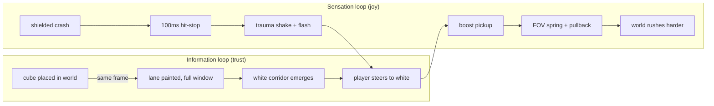
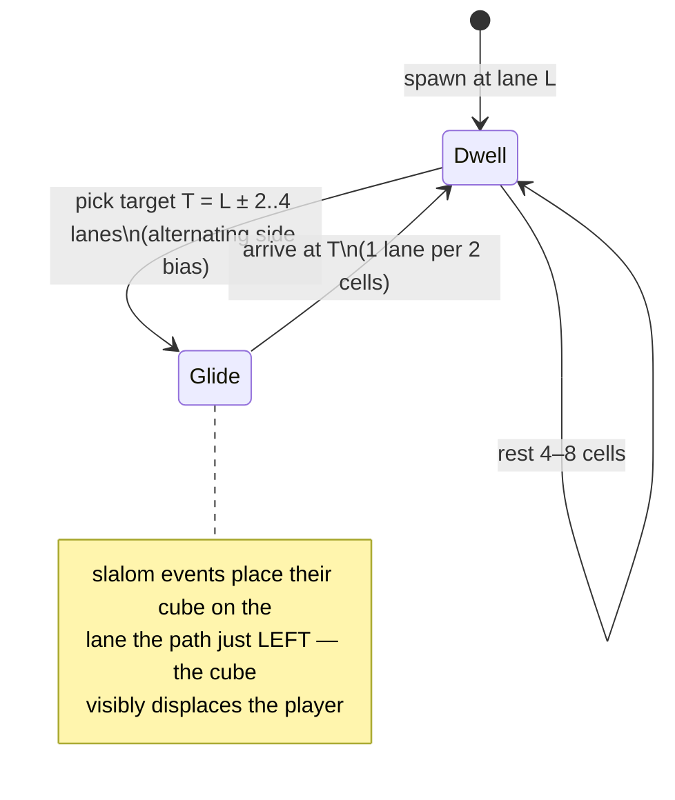

# Game Feel: Full-Track Telegraphing, Conversational Obstacles, And Boost Juice

Status: `[_]`
Date: 2026-06-11
Scope: make the game *fun* — telegraph every cube from the moment it exists, let the white path guide the player, choreograph obstacles as a conversation instead of an ambush, and make boosts and crashes feel physical.

## Problem Statement

The MVP is correct but not yet delicious. The design brief, distilled:

- **Telegraphing should start at placement.** In Boost 2, the lane was colored the moment an obstacle existed on the track — the warning *is* the track. Our current trail fades in only within ~14 cells (~2 s), so distant cubes are invisible information.
- **The white path should lead.** Boost 2 always kept a clean white corridor readable through the noise, "moving you towards that pure white path" — sometimes narrowing to one tense little hole, but always there for an attentive player.
- **Cubes should converse, not ambush.** Obstacles should feel like they are steering the player — call and response — not like random clutter the player fights.
- **Boosts must feel great.** Speed should be felt in the camera and the body of the game, not just in the HUD number.
- **The tube should be curvier**, because telegraphs (not sightlines) now carry the information around blind bends.
- **Tension without unfairness**: challenging, occasionally hairy, but always navigable when paying attention.

## Executive Summary

Four workstreams, ordered by fun-per-line-of-code:

1. **Telegraph at placement + emergent white path.** Give the telegraph trail a *floor*: any panel with a cube anywhere ahead of it in its lane gets a faint persistent tint across the whole render window, ramping to full saturation in the last ~10 cells. The safe corridor is the only thing left pure white — the "white river" emerges for free from honest danger marking, exactly Boost 2's negative-space signaling.
2. **Choreographed path + conversational placement.** Replace the jittery random-walk safe path with an intent-based *glide-and-dwell* path (pick a target lane, slide to it, rest, repeat), and place slalom cubes on the **outside of each turn** — the cube literally appears where you would have been, which reads as "the cube moved me." Group events into phrases with rest beats, and add a rare, difficulty-gated one-lane "needle gate" for spike tension.
3. **Boost and crash juice.** FOV widens with boost level on a slow spring (70° → ~98° at max, quadratic curve), camera pulls back slightly, pickups flash, shielded crashes get ~100 ms hit-stop plus trauma-based rotational screen shake, and game-over gets the full kit. All parameters straight from the juice literature (Eiserloh's trauma shake, Smash-style hitlag, Codrops FOV coupling).
4. **Curvier tube + speed-coupled camera.** Crank bend amplitude and add a shorter-wavelength component now that telegraphs carry information around bends; scale camera look-ahead with speed (~0.35 s of reaction distance) so fast play looks farther into the curve.

Everything composes with the existing architecture: telegraph changes live in `src/render/telegraph.ts`, choreography in `src/generation/`, juice in `src/render/camera.ts` + a tiny effects module, and none of it touches collision — the tube-space core guarantees feel work can't break correctness.



## Current State In The Repository

As of `5d5d797` (event-based patterns, colored cubes, boost-aware pacing):

| Feel ingredient | Where it lives | What exists | Gap vs the brief |
|---|---|---|---|
| Telegraph trail | `src/render/telegraph.ts` | Colored runway per lane, eased smoothstep over a 14-cell horizon, horizon scales with boost multiplier (capped at 34 cells in `src/render/tubeMesh.ts`) | Cubes beyond the horizon are unmarked — telegraph starts ~2 s out, not at placement |
| White path | emergent only within horizon | Safe corridor is cleared by construction (`src/generation/sections.ts` masks `& ~corridorMask`) | Beyond the horizon everything is white, so white ≠ safe; the river only forms close-in |
| Safe path shape | `src/generation/safePath.ts` | Random walk, `turnChance` 0.34–0.58, ±1 lane steps | Jittery wandering; no intent, no rhythm — the path doesn't *lead* anywhere |
| Obstacle placement | `src/generation/patterns.ts` | Five event families (slalom, gates, spiral, rail, weave) with blank beats; gaps scale with boost at generation time | Events are placed relative to the path but not *because* of it — no call-and-response with the player's motion |
| Phrasing | `src/generation/sections.ts` | Uniform event cadence per section | No phrases, no rest beats between clusters, no spike moments |
| Boost sensation | `src/render/camera.ts` | Fixed FOV 70, fixed look-ahead 14 units, fixed camera offset; roll damped at λ=12 (in the recommended 9–15 band) | Speed is invisible except for world flow rate; pickups are silent |
| Crash sensation | `src/render/ship.ts`, `src/game/run.ts` | Ship scales up + flashes red for 0.75 s (`crashFlashSeconds`) | No hit-stop, no shake, no screen flash; game-over feels identical to shielded crash |
| Bends | `src/tube/centerline.ts` | Two sinusoids per axis (amp ≤12), smoothstep ramp over 600 units | Gentle relative to Boost 2's "couldn't see ahead of you" curviness |
| Render window | `src/tube/space.ts` `VISIBLE_CELLS = 36` | 144 units ≈ 5 s at base speed, 1.3 s at max boost | Short for full-window telegraphs at 4× speed |

Frame budget is comfortable: measured ~8.3 ms median with full geometry rebuild per frame, so none of the proposals below are perf-risky.

## External Research

Full agent report distilled; sources in References.

- **Boost 2's telegraph is paint-at-placement.** AppSpy: *"focus on watching for coloured paths that appear before you — this will let you know when an object is about to come up."* The cue is embedded in the track surface, appears before the obstacle is visible, and the safe lane is distinct by *absence* of color — negative-space signaling, like Audiosurf's "grey = avoid, the safe path is the absence of grey."
- **Trauma-based screen shake** (Nijman's "Art of Screenshake" via Eiserloh's GDC 2016 camera talk): keep a `trauma ∈ [0,1]`, add 0.2–0.5 per hit, render `shake = trauma²`, drive offsets with smooth noise at ~40 Hz, decay linearly in ~0.25–2 s. For 3D, **rotational shake only** — translational shake in a tunnel reads as nausea.
- **Hit-stop**: Smash Ultimate's canonical `floor(damage·0.65 + 6)` frames; for a non-combat runner crash the literature consensus is **4–8 frames (67–133 ms)**; pickups get 0–2 frames and rely on flash instead.
- **FOV–speed coupling**: Codrops' Three.js light-trails demo documents 90°→140° on boost; conservative tunnel guidance is base 65–70°, max ~100°, quadratic exponent so the last boost tier feels like a punch, lerped slowly (λ≈3–5) so it breathes rather than cuts.
- **Camera look-ahead**: aim the camera ~0.35 s ahead of the player (visual processing + motor response), i.e. `lookAhead = base + speed × 0.35`.
- **Rest beats**: Sure Footing's procedural runner alternates obstacle-dense "sprints" with clear "rest pieces"; rhythm-game level design (Necrodancer, Thumper) phrases obstacles in 4–8 bar groups and uses deliberate syncopation breaks. Thumper's lesson: establish a rhythm, then *briefly* break it to refocus attention.
- **Flow channel** (Jenova Chen): difficulty must keep rising but never spike more than the player's skill ramp; in runner terms, escalate speed and gap tightness, never information quality. (This argues for keeping telegraphs at full strength forever; Boost 2's late-game cue fade-out becomes an optional "survival mode," not the default.)
- **Juice checklist** (Jonasson & Purho): every player-relevant event should answer on multiple channels at once (scale, flash, particles, shake, sound). Their breakout demo's crash recipe — squash, white flash, shake, fragments — maps directly onto our crash.

## Key Findings

1. **The white path is free.** We already guarantee a clear corridor by construction. The only reason it doesn't *read* as "the white path" is that un-telegraphed distance is also white. Give every dangerous lane a floor tint across the whole window and purity becomes meaning: white = provably safe, pastel = something someday, saturated = something *now*. No new geometry, no new data — a two-line change to `trailStrength` plus contrast tuning.

2. **"Conversation" is mostly about *where* the path turns, not where cubes sit.** A random-walk path makes every dodge feel arbitrary. An intent-based path (glide 2–4 lanes, dwell, glide back) creates readable musical motion, and placing the slalom cube **on the lane the path just vacated** makes causality legible: the cube *displaced* you. That single placement rule is the "conversation."

3. **Juice is cheap here because the camera is already the whole show.** The player-fixed camera means FOV, look-ahead, pullback, and roll-shake are each one small change in `camera.ts`. Hit-stop is a one-line dt clamp in the loop. The expensive juice (particles, audio) can wait; the camera-and-timing juice is the 80%.

4. **Curvier is now safe.** The original readability worry about hard bends was "you can't see the cubes coming." With paint-at-placement telegraphs, the *wall you can see* carries the warning even when the cube is around the bend — which is precisely how Boost 2 got away with intense curves. Collision is bend-proof by architecture, so curviness is purely a tuning dial.

5. **Boost should bend information, not just spacing.** We already stretch generation gaps by the boost multiplier. The missing halves are: telegraph floor (info at any distance), longer camera look-ahead, and a wider FOV — so high speed feels *fast but fair* instead of fast and blind.

## Options And Tradeoffs

### Telegraphing

| | A: Distance-faded (current) | **B: Floor + near-ramp (recommended)** | C: Binary full-strength lanes |
|---|---|---|---|
| Matches "telegraph at placement" | ❌ | ✅ | ✅ |
| White path emerges | only close-in | ✅ whole window | ✅ but… |
| Visual noise in dense sections | low | medium (pastel) | high — wall of color, white path lost in saturation |
| Urgency gradient ("how soon?") | ✅ | ✅ floor→ramp keeps it | ❌ no distance information |

### Safe path shape

| | A: Random walk (current) | **B: Glide-and-dwell intent path (recommended)** | C: Hand-authored phrase library |
|---|---|---|---|
| Reads as intentional | ❌ jitter | ✅ musical lines | ✅✅ |
| Implementation cost | — | small (rewrite `safePath.ts`, ~50 LOC) | large (authoring + selection system) |
| Variety | high but meaningless | high and legible (seeded targets/dwells) | bounded by authored set |
| Enables "cube displaced you" placement | weakly | ✅ turns are discrete, known events | ✅ |

### Boost/crash feel

| | A: Camera-only (FOV + pullback) | **B: Camera + timing (hit-stop, shake, flash) (recommended)** | C: Full juice (particles, audio, trails) |
|---|---|---|---|
| Perceived speed | ✅ | ✅ | ✅✅ |
| Impact weight | ❌ crashes stay mushy | ✅ | ✅✅ |
| Cost | tiny | small (one effects module + dt clamp) | days; needs audio pipeline |
| Risk | none | low (rotational-only shake, short stops) | scope creep |

Option C for all three tracks is the eventual destination; B is the right next step everywhere.

## Recommendation

Ship the four workstreams in this order — each is independently playable and testable.

### 1. Telegraph at placement, white path emergent

- `trailStrength` becomes floor-plus-ramp: `strength = cellsToTarget > NEAR ? FLOOR : FLOOR + (1−FLOOR)·smoothstep(1 − cellsToTarget/NEAR)` with `FLOOR ≈ 0.22`, `NEAR = 10` cells, **no far cutoff** — the backward pass already scans `VISIBLE_CELLS + horizon`, so extend the scan to the whole window and let every placed cube mark its lane the frame it enters it.
- Tint mix stays color-per-cube; at floor strength the tint is a pale pastel (≈0.18 mix), unmistakably non-white but far from urgent.
- Boost-scaled horizon now scales `NEAR` (the urgency ramp), not the floor — at 4× boost the ramp starts ~30 cells out.
- Raise `VISIBLE_CELLS` 36 → 48 (perf headroom is ~2×; re-measure) so max-boost play has ≥1.7 s of painted track on screen.

### 2. Conversational generation



- Rewrite `generateSafePath` as glide-and-dwell; expose the turn schedule (cell, fromLane, toLane) to the section generator.
- Placement rules per family: slalom cubes sit on just-vacated lanes at each glide; consecutive gates shift their gap by ≤2 lanes (stepping, not teleporting); rails run along the *outside* of a long glide like a banister.
- Phrase structure in `sections.ts`: 3–5 events of the section's family, then a rest of 6–8 blank cells (scaled by boost pacing, as gaps already are), then the next phrase. The Thumper trick, used sparingly: one phrase per section may syncopate (halve one gap) — difficulty-gated.
- **Needle gate**: at difficulty > 0.5, roughly once per section, a gate with a 1-lane gap directly on the safe lane, telegraph-saturated, preceded by an extra-long rest so it reads as a held breath, not a cheap shot. Validator (`src/generation/validate.ts`) already proves reachability.

### 3. Boost and crash juice

New `src/render/effects.ts` owning a small mutable feel-state; consumed by `camera.ts` and a DOM overlay:

| Event | Response (all simultaneous) |
|---|---|
| Boost pickup | FOV spring target +tier (see below) with +6° overshoot for ~0.3 s; camera pullback +0.5; white 2-frame DOM flash; HUD pulse (exists) |
| Shielded crash | Hit-stop: clamp dt to 0 for 100 ms (6 frames); trauma += 0.5; red vignette flash decaying 300 ms; ship squash (scale x1.3, y0.7, recover ~0.25 s) |
| Game-over crash | trauma += 0.8; longer red flash; slow-mo 0.25× for 400 ms before the overlay (instead of a hard cut) |

- FOV: `target = 70 + 28·(boostLevel/3)²` → 70 / 73 / 82 / 98°, lerped with λ≈4; pickup overshoot via critically-damped spring.
- Shake: `shake = trauma²`, **rotation only** — roll ±0.06 rad, pitch/yaw ±0.03 rad max, smooth noise ~40 Hz (sum of two incommensurate sines is fine; `Math.random` is unavailable per-frame determinism anyway), trauma decays at 1.5/s.
- Hit-stop implementation: a `freezeSeconds` field in run state; the loop passes `dt = 0` to `updateRun` while it drains. One clamp, no other system changes.

### 4. Curvier tube, longer eyes

- `centerline.ts`: amp 12→16 on x, add a third component (wavelength 90–150, amp ≤4) per axis; ramp 600→450. Keep max lateral slope `Σ Aᵢωᵢ` under ~0.35 so the camera look-at never leaves the tube interior.
- `camera.ts`: `LOOK_AHEAD = clamp(10 + speed·0.3, 14, 42)` units; keep roll damping λ=12 (already in the recommended band).

```mermaid
sequenceDiagram
  participant Loop as main loop
  participant Run as game/run
  participant FX as render/effects
  participant Cam as render/camera
  Loop->>FX: events (pickup / crash / gameOver)
  FX->>FX: trauma += x, fovSpring.kick(), freeze = 0.1s
  Loop->>Run: updateRun(dt = freeze > 0 ? 0 : dt)
  Loop->>Cam: updateCameraRig(..., fov(FX), lookAhead(speed), shake(FX))
  Cam->>Cam: fov lerp λ≈4, rotational shake = trauma²·noise
```

## Example Code

Floor-plus-ramp telegraph (the heart of workstream 1):

```ts
// src/render/telegraph.ts
const TRAIL_FLOOR = 0.22;      // visible the moment a cube exists in-window
const NEAR_RAMP_CELLS = 10;    // urgency ramp, scaled by boost multiplier

export const trailStrength = (cellsToTarget: number, nearCells = NEAR_RAMP_CELLS): number => {
  if (!Number.isFinite(cellsToTarget)) return 0;        // nothing ahead: pure white
  if (cellsToTarget <= 0) return 1;
  const t = Math.max(0, 1 - cellsToTarget / nearCells); // 0 far → 1 at the cube
  return TRAIL_FLOOR + (1 - TRAIL_FLOOR) * t * t * (3 - 2 * t);
};
```

Trauma shake + FOV spring sketch (workstream 3):

```ts
// src/render/effects.ts
export type FeelState = {
  trauma: number;        // [0,1], add 0.5 shielded crash / 0.8 game over
  freezeSeconds: number; // hit-stop remaining
  fov: number;           // current, lerped toward fovTarget(boostLevel)
  fovVelocity: number;   // spring overshoot on pickup
};

export const fovTarget = (boostLevel: number): number =>
  70 + 28 * (boostLevel / 3) ** 2;

export const shakeRotation = (trauma: number, time: number) => {
  const shake = trauma * trauma;
  return {
    roll:  0.06 * shake * (Math.sin(time * 41.3) + Math.sin(time * 27.7)) / 2,
    pitch: 0.03 * shake * (Math.sin(time * 38.9 + 1.7) + Math.sin(time * 23.1 + 0.5)) / 2,
  };
};
```

Glide-and-dwell path (workstream 2):

```ts
// src/generation/safePath.ts — sketch
// Emit both the lane-per-cell array AND the turn schedule so patterns can
// place cubes on just-vacated lanes.
export type PathTurn = { readonly cell: number; readonly from: Lane; readonly to: Lane };
export type ChoreographedPath = {
  readonly lanes: readonly Lane[];
  readonly turns: readonly PathTurn[];
};
```

## Risks And Open Questions

| Risk | Why it matters | Mitigation |
|---|---|---|
| Pastel floor reads as noise in dense late sections | The white river must stay legible | Floor mix capped ≈0.18; phrase rests guarantee periodic clean stretches; validate with a screenshot at difficulty 1.0 |
| Hit-stop + shake during 4× boost feels like a glitch | Timing effects compress at speed | Hit-stop is wall-clock (100 ms regardless of game speed); shake rotational-only |
| FOV 98° distorts tube edges | Wide FOV in a confined tube fish-eyes hard | 98° is below the 100–110 guidance ceiling; if ugly, drop max to 90 and add pullback instead |
| Glide-and-dwell makes the game easier | Predictability cuts challenge | Needle gates + syncopated phrases + speed are the difficulty; info-quality stays max (flow-channel rule) |
| Slow-mo on game over delays restart | Players restart fast and often | Keep it 400 ms and skippable by any key |
| Open: should survival mode fade telegraphs (Boost 2 late-game)? | Authentic but contradicts "always telegraphed" | Defer; build as a mode flag, not a difficulty stage |
| Open: audio | Half of "Juice it or lose it" is sound | Out of scope here; effects module should emit events an audio layer can later subscribe to |

## Implementation Checklist

Workstream 1 — telegraph at placement:

- [ ] `trailStrength` → floor (0.22) + near-ramp (10 cells, boost-scaled) with no far cutoff; backward scan covers the full render window.
- [ ] Tint mix tuning: floor ≈0.18 mix pastel, full ramp 0.8; boost trail unchanged.
- [ ] Raise `VISIBLE_CELLS` 36 → 48; re-measure frame time (budget: ≤12 ms median).
- [ ] Unit tests: floor strength present at window edge; white only where no cube ahead; ramp monotonic.

Workstream 2 — conversational generation:

- [ ] Rewrite `generateSafePath` as glide-and-dwell returning `{lanes, turns}`; keep ±1 lane/cell max step (validator contract).
- [ ] Slalom places cubes on just-vacated lanes at each turn; gates step gap ≤2 lanes between consecutive gates; rails ride the outside of long glides.
- [ ] Phrase structure: 3–5 events + 6–8 cell rest, boost-scaled; one syncopated gap per section at difficulty >0.4.
- [ ] Needle gate: 1-lane gap on the safe lane, ≥0.5 difficulty, ≤1 per section, extra-long preceding rest.
- [ ] Unit tests: turn schedule matches lane array; needle sections pass reachability; phrase rests exist (≥6 consecutive empty cells between phrases).

Workstream 3 — juice:

- [ ] `src/render/effects.ts`: FeelState (trauma, freezeSeconds, fov spring), event intake from run results.
- [ ] Hit-stop: dt clamp in `main.ts` loop (wall-clock 100 ms shielded crash; 0 for pickups).
- [ ] Camera: FOV lerp λ≈4 toward `fovTarget(boostLevel)` + pickup overshoot spring; pullback +0.5·boostLevel; rotational trauma shake.
- [ ] DOM overlay flashes: white 2-frame on pickup, red 300 ms decay on crash; game-over slow-mo 0.25× for 400 ms, key-skippable.
- [ ] Ship squash on crash (x1.3/y0.7 → recover 0.25 s) replacing the plain scale-up.
- [ ] e2e: pickup raises rendered FOV (assert via `camera.fov`); shielded crash freezes distance for ~0.1 s then resumes.

Workstream 4 — curvier + eyes:

- [ ] `centerline.ts`: third sinusoid per axis, amp x→16, ramp 450, slope cap ≤0.35 asserted in a unit test.
- [ ] `camera.ts`: speed-coupled look-ahead `clamp(10 + speed·0.3, 14, 42)`.
- [ ] Playtest screenshot set: straight vs max-bend at base and 4× boost — telegraphs legible around blind bends.

## Validation Checklist

- [ ] A cube's lane is tinted the same frame the cube enters the render window (unit test on telegraph field at window edge).
- [ ] At any moment, every pure-white lane on screen is provably safe for the full window (unit test: white ⇒ no cube ahead in-window in that lane).
- [ ] In a dense difficulty-1.0 section there is exactly one obviously-white corridor and it tracks the safe path (screenshot + field assertion).
- [ ] Slalom cubes land on just-vacated path lanes ≥80% of turns (generation unit test).
- [ ] Boost pickup visibly widens FOV within 0.5 s; max boost ≈98°, returns to 70° after crash.
- [ ] Shielded crash: world freezes ~6 frames, shakes, flashes red, and the run continues; game-over adds slow-mo before the overlay.
- [ ] Frame time ≤12 ms median with `VISIBLE_CELLS = 48` and max trail coverage.
- [ ] All existing unit + e2e suites stay green (collision untouched by any of this).
- [ ] Human playtest: a first-time player can articulate "stay on the white path" unprompted; an experienced player survives ≥2 needle gates per run.

## References

- Prior explorations: `docs/explorations/0000_[_]_WARP_VOYAGE_WEB_GAME_MVP_DESIGN.md`, `docs/explorations/0001_[x]_MVP_REBUILD_TUBE_SPACE_CORE.md`
- [Boost 2 review — AppSpy (lane-coloring telegraph, "coloured paths that appear before you")](https://www.appspy.com/review/3855/boost-2/)
- [Juice It or Lose It — Jonasson & Purho, GDC Vault](https://www.gdcvault.com/play/1016487/Juice-It-or-Lose) · [talk video](https://www.youtube.com/watch?v=Fy0aCDmgnxg)
- [The Art of Screenshake — Jan Willem Nijman (archive)](https://archive.org/details/the-art-of-screenshake)
- [Math for Game Programmers: Juicing Your Cameras — Squirrel Eiserloh, GDC 2016 (trauma shake, asymptotic follow)](https://archive.org/stream/GDC2016Eiserloh/GDC2016-Eiserloh_djvu.txt)
- [Hitlag formulas — SmashWiki](https://www.ssbwiki.com/Hitlag)
- [Frame-rate independent damping using lerp — Rory Driscoll](https://www.rorydriscoll.com/2016/03/07/frame-rate-independent-damping-using-lerp/)
- [High-speed Light Trails in Three.js — Codrops (FOV 90→140 boost coupling)](https://tympanus.net/codrops/2019/11/13/high-speed-light-trails-in-three-js/)
- [Keep Running: Procedural Level Generation in Sure Footing (sprints + rest pieces)](https://www.gamedeveloper.com/design/keep-running-procedural-level-generation-in-sure-footing)
- [Flow in Games — Jenova Chen MFA thesis](https://www.jenovachen.com/flowingames/Flow_in_games_final.pdf)
- [Syncopation: An Analysis of Thumper — GiantBomb](https://www.giantbomb.com/forums/thumper-632802/syncopation-an-analysis-of-thumper-1810242/)
- [Explosions in Vlambeer's Nuclear Throne — CTRL500 (two-circle particle economy)](https://ctrl500.com/game-design/explosions-in-vlambeers-nuclear-throne/)
- [Race the Sun postmortem — Game Developer](https://www.gamedeveloper.com/business/postmortem-flippfly-s-i-race-the-sun-i-)
- [Principles of Virtual Sensation — Steve Swink](https://www.gamedeveloper.com/design/principles-of-virtual-sensation)
- [Instant Game Feel — Springs Explained](https://www.gamedeveloper.com/blogs/instant-game-feel---springs-explained)
