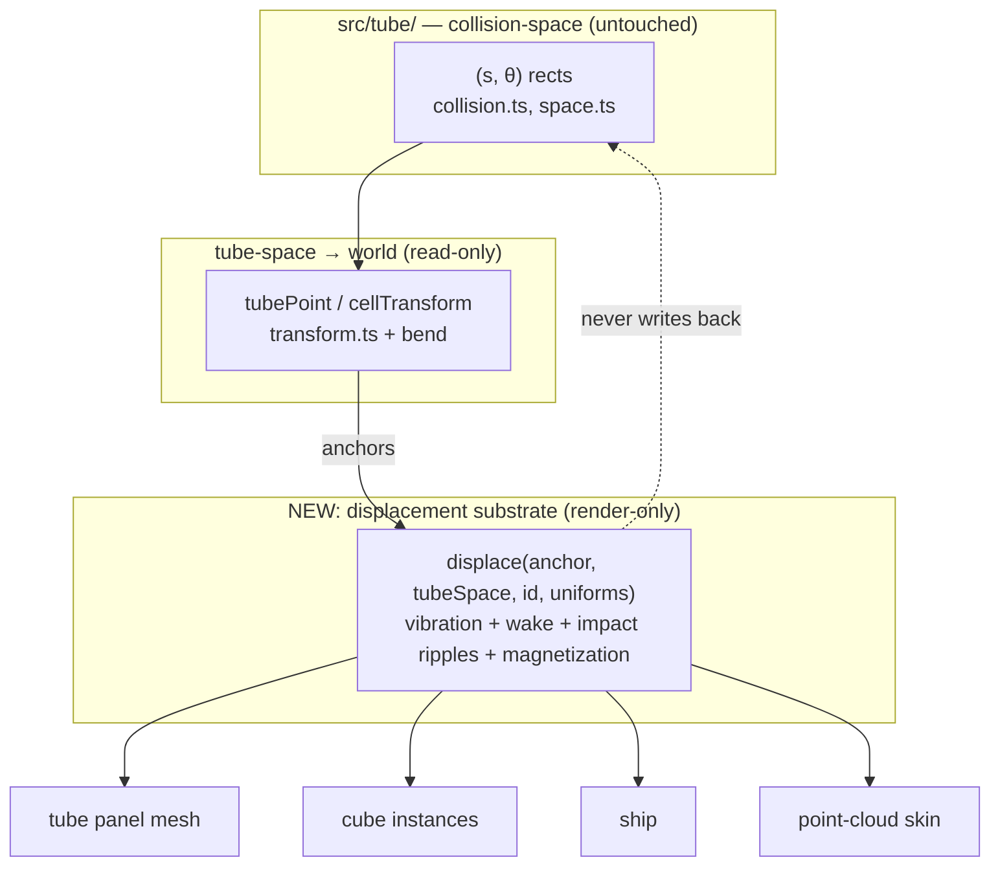
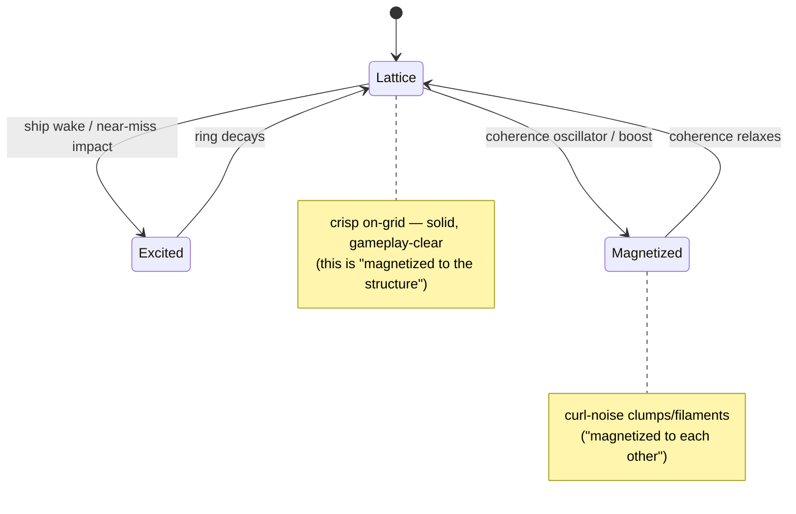
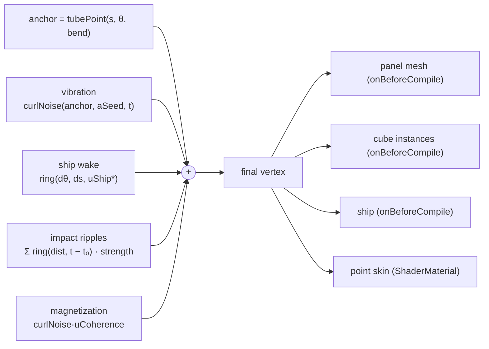

# Magnetic Particle Substrate: Making Everything Feel Made Of Coherent, Rippling Particles

Status: `[_]`
Date: 2026-07-03
Scope: explore turning the tube surface, cubes, and ship into a field of subtly vibrating, coherent particles that stay trackable across space and time, occasionally "magnetize" into clumps, and ripple in response to the ship — the tunnel undulating as the ship skims it, a cube shivering on a near miss — without wrecking performance or the game's visual clarity.

## Problem Statement

The brief, distilled from the request:

- **Everything is particles.** The tunnel wall, the cubes, and ideally the ship should read as being *made of* many small particles rather than solid surfaces.
- **Subtle vibration.** Each particle jitters/breathes constantly — alive, not static.
- **Coherent and trackable.** A particle keeps its identity: you could follow one across space and time and it stays *that* particle. No flickering, no per-frame reseeding, no boiling static.
- **Sometimes magnetized to each other.** Occasionally particles attract into local clumps/filaments — a "magnetic" texture that comes and goes.
- **Ripple on proximity.** When the ship skims the tunnel surface, the tunnel undulates in the ship's wake. When the ship *nearly* misses a cube, the cube ripples in response.
- **Constraints, stated explicitly:** it must be **performant** (this is a 60 fps browser game), must **look good**, and must **not take away from the visual clarity** of the current stark white-on-white, high-contrast-cube presentation.

The interesting tension: the "glowing magnetic particle field" fantasy usually lives on a black background with additive bloom, while warp-voyage is a minimalist **black-on-white** world where clarity is the whole point. The design job is to get the particle *feel* without spending the clarity.

## Executive Summary

**Do not build a particle physics simulation.** Build a **purely-visual displacement layer** in the vertex shader, layered on top of the tube-space geometry exactly the way the centerline *bend* already layers undulation on top of collision-space today. Collision stays pure `(s, θ)`; particles never feed back into gameplay.

The recommendation is a **hybrid GPU vertex-displacement substrate**, staged:

1. **Shared displacement function (one GLSL chunk, four surfaces).** Author one `displace(anchor, tubeSpace, id, uniforms)` GLSL function and inject it into the tube panel mesh, the cube instanced mesh, the ship, and a new point-cloud "skin." This mirrors how `src/tube/transform.ts` is the single source of truth for tube-space→world: now there is a single source of truth for *how everything vibrates, ripples, and magnetizes*, so the tube's ripple and a cube's shiver are literally the same wave math and stay coherent for free.
2. **Particle skin, meshes kept underneath.** Keep the solid white panels, the dark grid, and the solid colored cubes (the things that carry gameplay meaning), and *scatter a cloud of small points across their surfaces* as texture. The mesh preserves silhouette and telegraph legibility; the points supply the "made of particles" grain. Both are driven by the same `displace()`, so they move as one.
3. **Coherent vibration via stable IDs + curl noise.** Each particle carries a stable hash of its **absolute** tube-space address `(cell, lane, point-index)` — not its sliding-window slot — so it stays *that* particle as the world scrolls past. Vibration is low-frequency curl noise seeded by that hash: smooth, followable, never boiling.
4. **Ripples from the seams we already have.** The ship's `(s, θ)` is known every frame → feed it as a uniform and the tube shader paints a trailing wake ring. Near-misses are a cheap extension of the collision scan `updateRun` already does → emit a small ring buffer of impact events `(s, θ, t₀)` as uniforms, and the cube shader ripples outward from its own center. `crashFlashSeconds` is the precedent: a presentational field carried on `RunState`, computed in `updateRun`, touching nothing in `collision.ts`.
5. **"Magnetized" as a scalar, not an N-body sim.** A `coherence` uniform blends each particle between *lattice* (sitting crisply on its anchor — solid, gameplay-clear) and *magnetized* (drifting along a curl-noise flow field into filaments and beads). Because neighbors sample nearby field values, they clump together coherently. Pulse `coherence` on a slow oscillator (and on boosts) so magnetization is an occasional spice, not the constant state.

Cost is dominated by a single per-cloud draw call and one vertex shader; per-frame CPU work stays O(uniforms), not O(particles). Target ~30–60k points, comfortably 60 fps on an integrated GPU. Clarity is protected by keeping the meshes, keeping displacement amplitude small near danger, and — critically — **staying on the white background** (dark/palette points, normal alpha blend) rather than chasing additive glow, which is a separate, larger art-direction decision.



## Current State In The Repository

As of `c1fa489`, the renderer is deliberately minimal and CPU-driven. Everything is regenerated per frame from tube-space and drawn with unlit `MeshBasicMaterial`. There is no post-processing pipeline (no `EffectComposer`), no custom shader, and the clear color is pure white.

| Surface | Where | How it's drawn today | Particle-substrate implication |
|---|---|---|---|
| Renderer / background | `src/render/scene.ts:26-34` | `WebGLRenderer({antialias, powerPreference:"high-performance"})`, `setClearColor(0xffffff)`, pixelRatio capped at 2 | White background ⇒ additive/bloom "glow" is a no-op; dark points on white is the on-brand path |
| Tube wall | `src/render/tubeMesh.ts` | `Mesh` + `MeshBasicMaterial({vertexColors, side:DoubleSide})`; `PANEL_VERTEX_COUNT = VISIBLE_CELLS*LANES*6 = 2592` verts, **fully rebuilt every frame** in `updateTubeView` via `tubePoint(...)`; a dark `LineSegments` grid (`0x111111`) | Only 2.6k verts — can stay CPU-driven or move to GPU; the per-frame rebuild loop is exactly where a point scatter hooks in |
| Grid lines | `src/render/tubeMesh.ts:86-90` | `LineSegments`, `LineBasicMaterial({color:0x111111})` | The grid is the current "lattice"; particles snapping to it *is* the magnetized-to-structure state |
| Cubes | `src/render/obstacles.ts` | `InstancedMesh(BoxGeometry, MeshBasicMaterial, MAX_CUBES=432)`, per-instance palette color via `setColorAt`, placed with `cellTransform` | Instanced material takes `onBeforeCompile` injection; per-cube ripple needs a per-instance "impact age" attribute |
| Boosts | `src/render/obstacles.ts:50-58` | Separate thin `InstancedMesh`, cyan | Same treatment as cubes if desired |
| Ship | `src/render/ship.ts` | `Group` of `BoxGeometry` body + `ConeGeometry` nose + accent box, `MeshBasicMaterial`; positioned at `(playerS - 0.8, playerAngle)` | Low-poly; a point skin needs a denser sampling or it looks sparse |
| Camera | `src/render/camera.ts` | Player-fixed; world spins around it; roll damped | Impact positions must live in the moving render frame — store ripples in `(s, θ)` and resolve in-shader |

**The architectural gift — the bend precedent.** `src/tube/centerline.ts` already does exactly the thing we want, at surface scale: it displaces the whole tube laterally by smooth functions of `s`, *at render time only*. Its header comment is the whole thesis of this exploration:

> "`s` stays exact arc length along the tube axis, so `(s, θ)` collision math is unaffected by any amount of undulation. Collision never calls into this file."

`bendOffset(s, bend)` is `Σ amplitudeᵢ · sin(s·frequencyᵢ + phaseᵢ)` with a `smoothstep` warmup ramp — a handful of sinusoids, trivially portable to GLSL. Particle vibration and ripples are the same idea one scale down: more sinusoids, driven partly by uniforms (ship position, impact times) instead of only by `s`.

**The proximity precedent.** `src/render/telegraph.ts` already computes, per panel, a scalar response to something nearby (distance to the next cube in that lane) and tints the panel. A ripple field is the same shape of computation — a per-vertex scalar response to a nearby event — just transient and displacing instead of steady and coloring.

**The presentational-state precedent.** `RunState.crashFlashSeconds` (`src/game/run.ts:107-110`) is a non-gameplay field carried on run state, computed inside `updateRun`, consumed only by rendering (`src/render/ship.ts`). Near-miss ripple events are the same pattern: computed in the scan `updateRun` already runs (`framesNearDistance`), carried on `RunState`, consumed only by the shader. Nothing new touches `collision.ts`.

The memory note **[[tube-space-architecture-rule]]** is the invariant to protect: `src/tube/` solely owns spatial math; collision is pure `(s, θ)`. The particle substrate reads tube-space transforms and *never* writes back.

Frame budget headroom is real: exploration `0002` measured ~8.3 ms median with the full CPU geometry rebuild, leaving comfortable room under 16.6 ms.

## External Research

_(Web-research pass folded in; sources in References.)_

**Real particle physics is the wrong tool; vertex displacement is the right one.** The dominant modern technique for "a surface made of animated particles" is not a CPU/GPGPU simulation — it is rendering geometry as `THREE.Points` (or instanced quads) with a **custom `ShaderMaterial`**, and displacing each point in the *vertex shader* from static per-point attributes plus a few uniforms. There is no per-particle state to store or step; the position is a pure function `f(anchor, id, time, uniforms)` evaluated fresh each frame on the GPU. This is how Bruno Simon's Three.js Journey "animated galaxy" and countless Codrops/Maxime Heckel particle pieces work, and it scales to hundreds of thousands of points because each point is a single vertex and the whole cloud is one draw call.

**Curl noise is the standard for coherent, "magnetized" motion.** Robert Bridson's *Curl-Noise for Procedural Fluid Flow* (SIGGRAPH 2007) gives a **divergence-free** noise field: take the curl of a potential field so the flow neither sources nor sinks. Particles advected through it move in smooth, swirling, filament-forming paths — and crucially, *neighboring particles sample nearby field values, so they move together*. That coherence is exactly the "magnetized to each other, forming clumps and threads" look, achieved with zero inter-particle communication. GLSL simplex/curl-noise implementations (Ashima / Stefan Gustavson `webgl-noise`, and the widely-copied `snoise`/`curlNoise` snippets) are cheap enough to sample per vertex.

**GPGPU (ping-pong FBO) is the escalation, not the default.** When you *do* want persistent per-particle velocity/state (true flow-field advection with memory, trails, real attraction), the pattern is `GPUComputationRenderer`: encode positions and velocities in floating-point textures and ping-pong render them through fragment shaders. The most relevant official example is **`webgl_gpgpu_water`**, which drives *ripple propagation across a mesh's vertices from a moving impact point* — almost exactly our ship-wake/near-miss use case, just stateful. (`webgl_gpgpu_birds` is the flocking variant; Bruno Simon's "GPGPU Flow Field Particles" lesson is the tutorial.) It is powerful but heavier and harder to keep gameplay-legible; it is the right tool only if stateless displacement proves insufficient.

**Concrete budgets and the library landscape (verified 2026).** On integrated GPUs (Iris Xe / Apple M-class): vertex-shader-only point sprites hold **~200–400k** particles (fill-rate/overdraw, not vertex count, is the ceiling once points are large and blended); GPGPU-simulated particles are safe at **~65–200k**, with a **256×256 texture = 65,536 particles** repeatedly cited as the comfortable target that leaves frame headroom. Our ~30–60k estimate is well inside the stateless-displacement regime. On libraries: prefer a **hand-written `ShaderMaterial`** for a bespoke look — `three-nebula` is effectively **abandoned** (npm 10.0.3, ~4 years stale, flagged inactive), while **`three.quarks`** (v0.17.x, actively maintained, has a node/VFX authoring workflow and experimental WebGPU nodes) is the one to reach for *only if* a visual authoring pipeline is wanted. A **WebGPU/TSL compute** path now supersedes legacy GPGPU on capable browsers (`webgpu_compute_particles` runs 500k) — a forward escape hatch if 65k ever feels tight and we're willing to gate WebGL2 as fallback.

**Impact/proximity ripples are a solved shader idiom.** A wave emanating from a point is `displacement = sin(dist·k − t·ω) · falloff(dist, t)` along the surface normal, where `dist` is distance from the impact and `falloff` is an envelope that grows then decays. Multiple concurrent impacts are a small uniform array (a ring buffer) summed in the shader. Shadertoy prior art to mine: `3l23Rh` (canonical mouse-reactive `sin(d·k − t)` ripple), `ld3yRf` (energy-shield rim `pow(1 − |dist − r|, N)` for the impact *flash* before the ring propagates), and `lsSGRc` (banded screen-space shockwave — useful only if we ever want a post-process "screen flinch" on a hard near-miss, distinct from the mesh-space ripple we want here).

**Point-cloud rendering gotchas the research flags repeatedly:**
- `gl_PointSize` is capped by the driver (often ~64 px) and points are always screen-facing squares; use a soft round mask in the fragment shader and `size / -mvPosition.z` attenuation for perspective.
- **Transparent points don't depth-sort**, so overlapping semi-transparent points flicker/z-fight. On a light background the clean answer is small, mostly-opaque points with `depthWrite:false` and normal alpha blending, avoiding additive entirely.
- **Additive blending + bloom presuppose a dark background.** On white, `white + anything = white`; the glow fantasy requires first darkening the world. Every "energy particle" reference (Heckel, Codrops, Simon) runs on near-black. This is the single biggest art-direction fork for this feature. (One perf note in additive's favor if we ever take that fork: additive blending is order-independent, so it needs *no* CPU depth-sort — which is exactly why it's the default for huge particle counts.)

**Keeping identity stable.** The coherence requirement ("trackable across space and time") maps to: seed every per-particle random by a **stable ID**, not by anything that changes per frame or per buffer-slot. Either bake a fixed index as an attribute (cleanest for us — it decouples the shader's identity hash from the collision `(s, θ)` math, matching this codebase's separation of concerns) or hash `gl_VertexID`/`gl_InstanceID` with a standard GLSL hash (`hash11`/`hash13`, Dave-Hoskins style). Break lockstep pulsing with a **time-phase offset** — `snoise(anchor, t + hash·phaseScale)` — which is cheaper and reads better for "vibration" than offsetting the sample position. The failure mode to avoid is indexing particles by a recycled buffer slot in a scrolling world, which makes them "boil."

## Key Findings

1. **The bend already proves the whole safety argument.** Arbitrary render-time displacement that leaves `s` (arc length) and `θ` untouched cannot affect collision — that is a load-bearing, tested property of this codebase, not a hope. The particle substrate is "the bend, but at particle scale and partly driven by uniforms." This is why the feature is low-risk despite looking dramatic.

2. **One displacement function keeps everything coherent by construction.** If the tube panel, the point skin, the cubes, and the ship all call the same `displace()` GLSL, then a ripple crossing from the tunnel wall onto a cube is *the same wave*, and the whole world reads as one continuous magnetic medium rather than four separately-animated objects. This is the render-layer analog of the single-source-of-truth rule that already governs tube-space.

3. **Identity must key off *absolute* tube-space, not the sliding window.** The renderer rebuilds cells `[baseCell, baseCell+VISIBLE_CELLS)` every frame; a particle indexed by window slot would represent a *different* patch of tunnel each frame and boil. Keying the particle's seed and anchor to absolute `(cell, lane, point-index)` makes it glued to a fixed patch that simply scrolls toward and past the camera — coherent and trackable, exactly as asked. Recycling IDs off the back of the window is fine because that patch has left the screen.

4. **The ripple triggers already exist as data flows.** Ship-over-tunnel needs only the ship's `(s, θ)` — already computed every frame in `main.ts`/`ship.ts`. Near-miss needs the collision scan — already run every frame in `updateRun` via `framesNearDistance`. No new systems; two small taps on existing flows, both purely presentational.

5. **Clarity is a budget, and the white background is where most of it is spent or saved.** The current game is legible because it is high-contrast and calm. Particles spend clarity when they (a) obscure silhouettes, (b) add motion noise near danger, or (c) demand a dark background for glow. The recommendation spends none of the third (stay white), little of the first (keep meshes), and manages the second (small amplitude near telegraphed danger; ripples are transient, danger telegraph stays steady color).

6. **"Magnetized" is best modeled as a state you visit, not a force you compute.** A single `coherence ∈ [0,1]` uniform interpolating lattice↔flow-field gives the come-and-go magnetic texture for one number's worth of cost, and ties naturally to gameplay beats (calm on the straights, agitated on boost/near-miss). True per-particle attraction (GPGPU) is available as an escalation but is not needed for the described feel.

## Options And Tradeoffs

### How the particles are simulated

| | A: CPU per-particle update | **B: GPU vertex displacement, stateless (recommended)** | C: GPGPU ping-pong (FBO state) |
|---|---|---|---|
| Particle budget @60fps | ~a few k before JS + re-upload stalls | 100k+ (single draw, one vertex each) | 100k+, but 2–4 extra fullscreen passes |
| Coherent/trackable | manual | ✅ stable-ID hash, deterministic | ✅ but state can drift/reseed on resize |
| True inter-particle attraction | possible but slow | approximated via curl noise (reads as magnetized) | ✅ real force integration |
| Ripples | manual bookkeeping | ✅ uniform ring buffer | ✅ write into state |
| Complexity / risk | low concept, bad perf | **medium, well-trodden** | high; hard to keep legible |
| Fits current CPU-rebuild renderer | drop-in but doesn't scale | additive layer | large rewrite |

### What actually gets drawn

| | A: Replace meshes with pure point clouds | **B: Hybrid — meshes + point skin (recommended)** | C: Displace mesh vertices only (no points) |
|---|---|---|---|
| "Made of particles" read | ✅✅ strongest | ✅ strong | ❌ "breathing surface," not particles |
| Silhouette / gameplay clarity | ❌ cube edges dissolve; telegraph harder | ✅ mesh carries the shape, points add grain | ✅✅ |
| Telegraph/white-path legibility | at risk | ✅ base panels still tint | ✅ |
| Cost | one cloud/draw | mesh + one cloud/draw | cheapest |
| Fallback value | — | — | ✅ good conservative first step |

### Background / glow direction

| | **A: Dark points on white (recommended first)** | B: Dark background + additive glow + bloom |
|---|---|---|
| On-brand with current look | ✅ preserves minimalist identity | ❌ major mood change |
| "Energy field" fantasy | partial (ink/graphite beading) | ✅✅ full |
| Clarity risk | low | medium–high (blooms wash edges) |
| Scope | this feature | this feature **+** a lighting/art-direction rework |
| Post-processing needed | none | `EffectComposer` + `UnrealBloomPass` |

### "Magnetization" model

| | **A: `coherence` scalar lattice↔curl-flow (recommended)** | B: Real neighbor attraction (GPGPU or grid hash) |
|---|---|---|
| Reads as "magnetized to each other" | ✅ clumps/filaments from shared field | ✅✅ literal |
| Cost | ~one noise sample/vertex | spatial hashing or O(n²); heavy |
| Controllable for clarity | ✅ one uniform, gate by gameplay | hard to bound |
| Determinism | ✅ | state-dependent |

## Recommendation

Ship a **hybrid, stateless, GPU vertex-displacement substrate on the existing white world**, in four stages, each independently shippable and reversible. Concretely: Option **B / B / A / A** from the tables above.

### Stage 0 — Coherent vibrating point skin (the 80%)

- New module tree `src/render/particles/`: a `displacement.glsl.ts` exporting the shared GLSL chunk, and `pointSkin.ts` building a `THREE.Points` cloud whose per-point static attributes are `aTubeS` (float), `aTheta` (float), `aSeed` (float hash of absolute `(cell,lane,index)`), and `aSurface`/`aColor` as needed.
- Scatter points across the visible tube wall (target ~48–64 points per panel ⇒ ~20–28k) and across cube faces for the visible cubes. Keep the existing panel mesh and cubes drawn underneath, slightly dimmed — the "solid core + particle shell" pattern, the safest guarantee that gameplay silhouettes stay legible no matter how dense the skin gets. (Sampling the panel mesh's *own* vertices as the point set is simplest but ties density to tessellation; a separately-scattered cloud is what buys real grain — worth the extra attribute buffer.)
- Vibration only, at first: `pos = anchor + curlNoise(anchor·k + aSeed + t·drift) · A_vib`, `A_vib ≈ 3–5%` of `TUBE_RADIUS`, low temporal frequency so a point is followable. Point size ~2–3 px with round soft mask, `depthWrite:false`, normal alpha blend, dark or palette-tinted.
- Because the point transform can reproduce `tubePoint`/`bendOffset` in GLSL, the cloud's anchors can be computed **on the GPU** from `(aTubeS, aTheta)` + bend uniforms, dropping per-frame CPU cost to updating a handful of uniforms and the active-range. (The 2.6k-vert panel mesh can stay CPU-driven initially.)

### Stage 1 — Ripples from the ship (the feature the request is really about)

- **Ship wake on the tunnel.** Add uniforms `uShipS`, `uShipTheta`, `uShipSpeed`. In `displace()`, compute angular distance `dθ` (wrapped) and longitudinal distance `ds = anchorS − uShipS`; add a trailing ring `A_wake · sin(len·k − t·ω) · falloff(len) · smoothstep(behindGate)` along the inward normal, so the wall lifts and undulates just behind and beside the ship and settles ahead of it. One continuous effect, three uniforms, no events.
- **Near-miss cube shiver.** Extend the scan in `updateRun`: alongside `resolveCollisionFrame`, test the player rect against each occupied cube dilated by a near-miss band (~1.0–1.5 lanes) and flag cubes that were grazed-but-not-hit as `s` passes their center; dedupe per cube (a `nearMissKey` like the existing `boostKey`). Emit a small ring buffer `impacts[N]` of `(s, θ, t₀, strength)` on `RunState` (presentational, like `crashFlashSeconds`). Pass it as a `uniform vec4 uImpacts[16]` (xyz-ish = `s,θ,t₀`, w = strength). In `displace()`, sum expanding rings from each active impact; the cube's own points ripple outward from center, and nearby wall points echo it. Store impacts in **tube-space** so the moving camera origin doesn't invalidate them.

```mermaid
sequenceDiagram
  participant Loop as setAnimationLoop (main.ts)
  participant Run as updateRun (game/run.ts)
  participant Scan as framesNearDistance scan
  participant RS as RunState (presentational)
  participant Tube as tube point material
  participant Cube as cube material
  Loop->>Run: updateRun(steer, dt)
  Run->>Scan: resolveCollisionFrame(...) [unchanged]
  Scan-->>Run: crashed? boost?
  Run->>Scan: nearMiss test (dilated rect, grazed-not-hit)
  Scan-->>RS: push impact (s, θ, t₀, strength)
  Loop->>Tube: uShipS/uShipTheta/uShipSpeed, uImpacts[]
  Loop->>Cube: aImpactAge / uImpacts[]
  Tube->>Tube: displace(): wake ring
  Cube->>Cube: displace(): outward shiver
```

### Stage 2 — Magnetization

- Add `uCoherence ∈ [0,1]`. In `displace()`, blend the anchor between its exact lattice position (`uCoherence→0`: crisp, on the grid) and a curl-noise-advected position (`uCoherence→1`: `anchor + curlNoise(anchor·kM + t·slowDrift)·A_mag`). Neighbors clump because they share the field — the cheapest possible "magnetized to each other," no inter-particle communication. (Richer turbulence, if wanted, comes from domain-warped fBm — `noise(p + noise(p))` — at a couple extra noise samples.)
- Drive `uCoherence` with a slow global oscillator (magnetism breathes in and out over ~8–15 s) plus event kicks: a boost pickup briefly excites it; near a strong telegraph it stays *low* (danger reads crisp). Optionally make it per-surface so the ship can stay coherent while the tunnel shimmers.
- **Reuse the impact buffer as a local attractor.** The same `uImpacts[]` ring buffer that drives ripples can add a temporary local pull/brightening near each event, so a near-miss both *ripples* the cube and briefly *magnetizes* the particles around it — one mechanism, two visual purposes. (If per-event granularity is ever needed beyond 16 slots, bake a small low-res attractor texture instead and sample it once per particle.)



### Stage 3 — Optional glow direction (deferred, gated behind an art decision)

Only if the team wants the full "energy" mood: introduce a dark/gradient background, switch points to additive blending, add `EffectComposer` + a tuned `UnrealBloomPass`, and re-tune every color for the inverted value scheme. **Budget warning:** `UnrealBloomPass` is a multi-pass full-screen effect measured at roughly **5–15 ms/frame at 1080p and 10–25 ms at 1440p** on iGPU-class hardware — on its own that can eat most of a 16.6 ms budget, so it would need to render at reduced internal resolution. This is a separate art-direction project and explicitly **not** required for the requested feel. Keep Stages 0–2 background-agnostic so this stays optional.

### The displacement pipeline (single function, four consumers)



## Example Code

The shared GLSL chunk (sketch) — one source of truth for how everything moves:

```glsl
// src/render/particles/displacement.glsl.ts  (exported as a string, injected everywhere)

uniform float uTime;
uniform float uShipS;         // tube-space arc length of the ship
uniform float uShipTheta;     // tube-space angle of the ship
uniform float uShipSpeed;
uniform float uCoherence;     // 0 = lattice (crisp), 1 = magnetized (flow)
uniform vec4  uImpacts[16];   // per impact: (s, theta, t0, strength)

// snoise / curlNoise assumed included above (Ashima webgl-noise)

float wrapAngle(float a){ return atan(sin(a), cos(a)); }        // → (-π, π]
float ringFalloff(float d, float age){                          // grow then decay
  float grow = smoothstep(0.0, 0.15, age);
  float decay = exp(-age * 2.5);
  return grow * decay * exp(-d * d * 0.15);
}

// anchorWorld: undisplaced world position; inward: unit normal toward axis;
// sTube/thetaTube: this vertex's ABSOLUTE tube-space address; seed: stable hash.
vec3 displace(vec3 anchorWorld, vec3 inward, float sTube, float thetaTube, float seed){
  // 1. coherent vibration — low freq, stable per particle
  vec3 vib = curlNoise(anchorWorld * 0.35 + seed * 17.0 + uTime * 0.25) * 0.22;

  // 2. ship wake — a trailing ring behind/around the ship
  float dth = wrapAngle(thetaTube - uShipTheta);
  float ds  = sTube - uShipS;
  float len = length(vec2(ds, dth * 4.0));
  float wake = sin(len * 1.1 - uTime * 6.0) * ringFalloff(len, max(0.0, -ds) * 0.4);
  vec3 disp = inward * wake * 0.5;

  // 3. impact ripples (near-miss shivers), summed over the ring buffer
  for (int i = 0; i < 16; i++){
    vec4 e = uImpacts[i];
    if (e.w <= 0.0) continue;
    float ed = length(vec2(sTube - e.x, wrapAngle(thetaTube - e.y) * 4.0));
    disp += inward * sin(ed * 1.6 - uTime * 8.0) * ringFalloff(ed, uTime - e.z) * e.w * 0.6;
  }

  // 4. magnetization — clump along a shared flow field when coherence is high
  vec3 mag = curlNoise(anchorWorld * 0.6 + uTime * 0.15) * 0.5 * uCoherence;

  return anchorWorld + vib + disp + mag;
}
```

Near-miss detection, as a presentational extension of the existing scan (no change to `collision.ts`):

```ts
// src/game/run.ts — sketch, inside updateRun's frame scan
// A near miss: player s-overlaps the cube's cell and passes within a band
// wider than the hitbox but not hitting. Emit once per cube (deduped).
const NEAR_MISS_LANES = 1.4;
const grazed = (player: PlayerState, cell: number, lane: number): number => {
  const gapAngle = Math.abs(shortestAngleDelta(player.angle, angleForLane(lane)));
  const band = NEAR_MISS_LANES * LANE_ANGLE;
  if (gapAngle >= band) return 0;                    // too far to feel it
  return 1 - gapAngle / band;                        // strength: closer = stronger
};
// push { s: cellCenterS(cell), theta: angleForLane(lane), t0: now, strength }
// into a bounded ripple buffer on RunState, deduped by `${sectionId}:${cell}:${lane}`.
```

Injecting `displace()` into the existing unlit meshes without rewriting them:

```ts
// give the tube panel + cube materials the same displacement
material.onBeforeCompile = (shader) => {
  shader.uniforms.uTime = uniforms.uTime;         // shared uniform objects
  shader.uniforms.uShipS = uniforms.uShipS;       // (…all of them)
  shader.uniforms.uImpacts = uniforms.uImpacts;
  shader.vertexShader = DISPLACE_CHUNK + shader.vertexShader.replace(
    "#include <begin_vertex>",
    `#include <begin_vertex>
     transformed = displace(transformed, aInward, aTubeS, aTheta, aSeed);`,
  );
};
```

## Risks And Open Questions

| Risk / question | Why it matters | Mitigation / lean |
|---|---|---|
| Particle skin dissolves cube silhouettes | Cubes are the gameplay; their edges must stay crisp | Keep the solid cube mesh; points are a skin, `A_vib` small; damp displacement where telegraph is strong |
| Motion noise near danger hurts readability | Player must read the white path calmly | Ripples are transient and ship-relative; steady danger stays *color* telegraph, not motion; lower `uCoherence` near strong telegraph |
| White background nullifies glow | The obvious "magnetic" look wants bloom | Stage 0–2 use dark/normal-blended points (on-brand); glow is a separate, opt-in Stage 3 with a background change |
| Transparent point z-fighting | Overlapping soft points flicker | Small mostly-opaque points, `depthWrite:false`, avoid additive; test at 2× pixel ratio |
| Moving render origin invalidates impact positions | Camera-relative coords drift each frame | Store impacts in tube-space `(s, θ, t₀)`; resolve to the current frame in-shader |
| Particle identity boils as cells recycle | Kills the "trackable" requirement | Seed by **absolute** `(cell,lane,index)`, not window slot; only recycle IDs after the patch leaves screen |
| Porting `bendOffset` to GLSL drifts from TS | Two sources of truth for the centerline | Generate the GLSL from the same component arrays, or unit-test GPU-vs-CPU anchor parity at sample `s` |
| Scatter density vs fill-rate on low-end iGPU | 60 fps is non-negotiable | Density is one uniform/constant; profile and scale points-per-panel to hit budget; cap by `VISIBLE_CELLS` |
| Open: does the ship become particles too? | Ship is low-poly; a sparse skin looks bad | Give the ship a denser bespoke point set, or keep it solid as the one crisp "you" anchor amid the shimmer (recommended) |
| Open: should magnetization respond to gameplay or just breathe? | Ties feel to mechanics vs ambient mood | Start ambient (slow oscillator); add boost/near-miss kicks in Stage 2 once it looks right |

## Implementation Checklist

Stage 0 — coherent vibrating skin:

- [ ] Add `src/render/particles/displacement.glsl.ts` with `curlNoise`/`snoise` + `displace()` (vibration term only to start).
- [ ] Add `src/render/particles/pointSkin.ts`: build `THREE.Points` with static `aTubeS`, `aTheta`, `aSeed` (absolute-address hash), `aInward` attributes; scatter ~48–64 pts/panel across the visible tube.
- [ ] GPU-side tube-space→world in the point vertex shader (port `tubePoint` + `bendOffset`), driven by bend + `originS` uniforms.
- [ ] Round soft-mask fragment shader; point-size attenuation; `depthWrite:false`, normal alpha blend, dark/palette tint.
- [ ] Wire into `src/render/scene.ts` and update uniforms in `main.ts`'s loop; keep panel mesh + cubes drawn underneath, dimmed.
- [ ] Unit test: GPU anchor (recomputed in TS) matches `tubePoint` within ε at sampled `(s, θ)`.

Stage 1 — ripples:

- [ ] Uniforms `uShipS`, `uShipTheta`, `uShipSpeed`; feed from `player` each frame; wake ring in `displace()`.
- [ ] Near-miss detection in `updateRun` (dilated rect, grazed-not-hit, deduped `nearMissKey`); bounded `impacts` ring buffer on `RunState`.
- [ ] `uniform vec4 uImpacts[16]` in tube-space; sum ring displacements; per-cube shiver + wall echo.
- [ ] Inject `displace()` into cube `InstancedMesh` material via `onBeforeCompile` with an `aInward`/impact hookup.
- [ ] Unit tests: near-miss fires once per graze, never on a hit or a clean pass; strength rises as the gap narrows; `collision.ts` untouched (existing suite green).

Stage 2 — magnetization:

- [ ] `uCoherence` uniform; lattice↔curl-flow blend in `displace()`.
- [ ] Slow oscillator + boost kick + telegraph damping to drive `uCoherence`.
- [ ] Optional per-surface coherence (ship stays crisp).

Stage 3 — glow (optional, gated):

- [ ] Prototype dark background + additive points + `UnrealBloomPass`; re-tune palette; decide go/no-go on clarity.

## Validation Checklist

- [ ] A single particle is visually trackable for its full on-screen life (screen-capture a marked point; it must not boil or reseed).
- [ ] The tunnel wall undulates in a trailing wake as the ship skims it, and settles ahead of the ship.
- [ ] A near miss makes *that* cube ripple within ~1 frame, and a clean pass or a direct hit does not.
- [ ] Magnetization visibly comes and goes (clumping ↔ crisp) over time, without a hard toggle.
- [ ] Cube silhouettes and the white safe-path corridor remain readable at difficulty 1.0 with the substrate on (side-by-side screenshots vs substrate-off).
- [ ] Frame time ≤ 12 ms median at target density on a mid-range integrated GPU; ≤ 16.6 ms worst case at 2× pixel ratio.
- [ ] `collision.ts` and all tube-space unit/e2e tests are unchanged and green — the substrate proved purely presentational.
- [ ] Toggling the substrate off returns the game to pixel-identical current rendering (feature is a clean layer).
- [ ] Human read: a new player still says "stay on the white path" unprompted; the particles register as texture, not clutter.

## References

- Prior explorations: `docs/explorations/0001_[x]_MVP_REBUILD_TUBE_SPACE_CORE.md`, `docs/explorations/0002_[_]_GAME_FEEL_TELEGRAPH_AND_FLOW.md`
- Repo invariant: memory `tube-space-architecture-rule` — `src/tube/` owns spatial math; collision is pure `(s, θ)`; `src/tube/centerline.ts` is the render-time-only displacement precedent.
- [Curl-Noise for Procedural Fluid Flow — Bridson, Hourihan, Nordenstam, SIGGRAPH 2007 (PDF)](https://www.cs.ubc.ca/~rbridson/docs/bridson-siggraph2007-curlnoise.pdf)
- [webgl-noise — Ashima Arts / Stefan Gustavson (GLSL simplex noise)](https://github.com/ashima/webgl-noise) · [Gustavson, "Simplex noise demystified"](https://weber.itn.liu.se/~stegu/simplexnoise/simplexnoise.pdf)
- [The Book of Shaders — Noise (Patricio Gonzalez Vivo & Jen Lowe)](https://thebookofshaders.com/11/) · [Fractal Brownian Motion](https://thebookofshaders.com/13/)
- [Three.js Journey — Particles, Animated Galaxy, GPGPU Flow Field Particles (Bruno Simon)](https://threejs-journey.com/)
- [The Magical World of Particles with React Three Fiber and Shaders — Maxime Heckel](https://blog.maximeheckel.com/posts/the-magical-world-of-particles-with-react-three-fiber-and-shaders/)
- [Maxime Heckel — "On Crafting Painterly Shaders" / FBO particle experiments](https://blog.maximeheckel.com/posts/on-crafting-painterly-shaders/)
- [three.js — `webgl_gpgpu_water` (ripple propagation from a moving impact — the direct analog to ship-wake/near-miss)](https://threejs.org/examples/#webgl_gpgpu_water) · [`webgl_gpgpu_birds`](https://threejs.org/examples/#webgl_gpgpu_birds) · [`GPUComputationRenderer` source](https://github.com/mrdoob/three.js/blob/dev/examples/jsm/misc/GPUComputationRenderer.js)
- [three.js — `webgpu_compute_particles` (500k via TSL compute; forward escape hatch from legacy GPGPU)](https://threejs.org/examples/#webgpu_compute_particles)
- [three.js — customizing built-in materials with `onBeforeCompile`](https://threejs.org/docs/#api/en/materials/Material.onBeforeCompile) · [`Points`](https://threejs.org/docs/#api/en/objects/Points) · [`ShaderMaterial`](https://threejs.org/docs/#api/en/materials/ShaderMaterial)
- [three.js — `UnrealBloomPass` / `EffectComposer` (Stage 3 glow direction; budget 5–25 ms/frame)](https://threejs.org/examples/#webgl_postprocessing_unreal_bloom)
- [three.quarks — actively-maintained node/VFX particle library (vs the abandoned three-nebula)](https://github.com/Alchemist0823/three.quarks) · [docs](https://docs.quarks.art/)
- [Lygia — reusable GLSL function library (noise, SDFs, color)](https://github.com/patriciogonzalezvivo/lygia)
- [Shadertoy ripple/force-field references — `3l23Rh`](https://www.shadertoy.com/view/3l23Rh) · [`ld3yRf`](https://www.shadertoy.com/view/ld3yRf) · [`lsSGRc`](https://www.shadertoy.com/view/lsSGRc)
- [Inigo Quilez — distance functions & useful analytic falloffs (for ring/impact shaping)](https://iquilezles.org/articles/distfunctions/)
- [Codrops — Three.js particle & displacement tutorials (collection)](https://tympanus.net/codrops/tag/three-js/)
